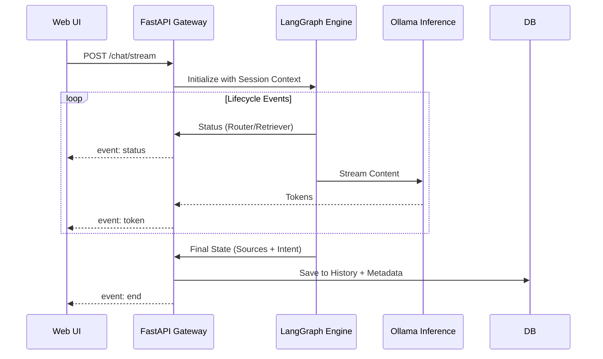

# API Server Guide (Platinum Edition)

The Backend is built with **FastAPI**, creating a high-performance, asynchronous REST API.

## Base URL
`http://localhost:8000`

---

## 🛠 Active Endpoints

### 1. Unified Streaming Chat
**POST** `/api/chat/stream`

Returns a Server-Sent Events (SSE) stream with real-time intent updates.

**Request Body:**
```json
{
  "message": "Compare @file1.pdf and @file2.pdf",
  "session_id": "sid_123456",
  "mode": "auto" 
}
```
*   **mode**: `auto` (Smart Routing), `rag` (Force Knowledge Base), or `chat` (Force Pure LLM).

**SSE Event Types:**
- `event: status`: Real-time steps (e.g., "Analyzing Intent", "Searching Documents...").
- `event: token`: Decoded JSON string of the next answer token.
- `event: end`: Final JSON payload containing:
  - `intent`: (chat, direct_rag, specific_doc_rag)
  - `sources`: Deduplicated context snippets (formatted as `Source: Name \nContent: text`).
  - `targeted_docs`: List of files extracted from @mentions.

---

### 2. Knowledge Base Status
**GET** `/api/documents`

Returns a list of all unique filenames currently stored in the vector store.

---

### 3. Intelligence Configuration
**GET** `/api/config`

Returns the current runtime models and hosts for both the Main Model and Embedding Model.

---

### 4. Session & Persistent Memory
**GET** `/api/sessions`
- Lists all active chat sessions with titles and last active timestamps.

**DELETE** `/api/sessions/{session_id}`
- Permanently wipes a session and its associated checkpointer data.

**GET** `/api/history/{session_id}`
- Returns the complete interaction history.
- **New Schema**: Messages now include a `thoughts` array for rendering the "Thinking Process" timeline in the UI.

---

## 🛰 Internal Sequence & Data Flow

### SSE Stream Orchestration


### Data Storage Strategy
We utilize **SQLite** with a dual-role approach:
1.  **LangGraph Checkpointer**: Stores the raw binary state of the agent's brain (allows for complex backtracking).
2.  **Custom History Table**: Stores human-readable messages with JSON-serialized metadata for immediate UI consumption.
