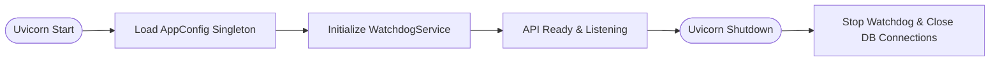
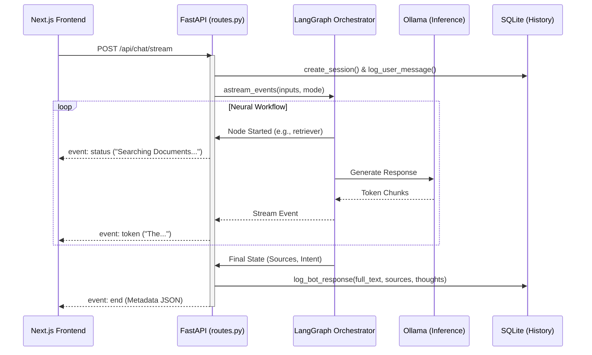

# API Server Master Encyclopedia: Architectural Deep-Dive (FastAPI Edition)

This encyclopedia provides the absolute technical "Source of Truth" for the **RAG Chat IPR API Server**. It covers the architecture from the very foundations of the FastAPI lifecycle to the complex orchestration of asynchronous LangGraph nodes and SSE (Server-Sent Events) streaming.

---

## 🏛 1. Foundational Architecture

The backend is built on **FastAPI**, an ultra-modern, high-performance web framework for building APIs with Python 3.10+ based on standard Python type hints.

### The Tech Stack
*   **Web Framework**: FastAPI (Asynchronous ASGI).
*   **ASGI Server**: Uvicorn (The lightning-fast worker).
*   **Protocol**: REST (for state) + SSE (Server-Sent Events) for real-time streaming.
*   **Concurrency**: 100% Asynchronous (`async`/`await`) to prevent blocking during heavy AI inference.

---

## 🔄 2. The Server Lifecycle (Lifespan Management)

Unlike simple scripts, the API server has a "Lifecycle." It doesn't just start; it *initializes* resources and *cleans up* on exit.

### Implementation Detail (`app.py`):
We use the **`@asynccontextmanager`** pattern to manage the server's lifespan.



**Why this matters**: This ensures that if you add a PDF while the server is starting, the `WatchdogService` is already "awake" and ready to index it.

---

## 🛰 3. Request-Response Lifecycle: The "SSE Handshake"

The most advanced part of the server is the **Streaming Chat Endpoint** (`/api/chat/stream`). It transforms a standard HTTP request into a persistent neural pipeline.

### The Logic Sequence:

1.  **Entry**: The frontend sends a JSON payload (Message + SessionID + Mode).
2.  **Session Priming**: The server checks **SQLite** (`history.py`) to create the session if it's new.
3.  **The SSE Generator**:
    -   FastAPI returns a `StreamingResponse`.
    -   The server starts a background `sse_generator()`.
    -   **Disconnection Monitoring**: Inside the loop, the server constantly checks `await request.is_disconnected()`.
    -   **Hard Stop**: If a disconnect is detected (e.g., user clicks the Stop button), the server immediately breaks the generator loop, which signals LangGraph to halt and prevents further AI token generation.
    -   **LangGraph Invoke**: The generator calls the AI workflow via `astream_events(...)`.
    -   **Event Interception**: As LangGraph nodes execute, the server "catches" events and yields them as `event: status`.
    -   **Token Yielding**: When the LLM starts speaking, the server catches `on_chat_model_stream` events and yields `event: token`.

### Visual Process Map:


---

## 🛠 4. Service Integration & Orchestration

The API Server acts as the **"Grand Central Station"** for the project. It connects these four decoupled services:

### A. The Configuration Guardian (`config.py`)
- **Role**: The single source of truth for your Ollama hosts and model names.
- **Implementation**: A Singleton class that the API checks at every request to ensure the models haven't changed.

### B. The History Engine (`history.py`)
- **Role**: Manages the SQLite persistent memory.
- **Implementation**: The API uses thread-safe connections to log messages *asynchronously* while the stream is still running.

### C. The Neural Graph (`workflow.py`)
- **Role**: The "Brain" that decides how to handle the query.
- **Implementation**: The API compiles the LangGraph once and invokes it with a `thread_id` (the session ID) to maintain "Long-term" state.

### D. The Vector Store (`store.py`)
- **Role**: Knowledge retrieval.
- **Implementation**: The API provides a `/api/documents` endpoint to let the frontend know which files are currently indexed.

---

## 🚀 5. Advanced Implementation Details

### Dynamic CORS (Cross-Origin Resource Sharing)
To ensure the frontend can talk to the backend even from different IP addresses (as addressed in Phase 20), we implement dynamic CORS middleware:
```python
app.add_middleware(
    CORSMiddleware,
    allow_origins=["*"], # In development, permits all local network IPs
    allow_credentials=True,
    allow_methods=["*"],
    allow_headers=["*"],
)
```

### JSON Tokenization
When streaming tokens, we use `json.dumps()` on every token before sending. 
**Why?** This ensures that special characters (like newlines or quotes) don't break the SSE protocol, which relies on specific line formatting.

### Metadata Post-Processing
After the AI finishes talking, the server performs a **Deduplication Pass** on the sources. If the AI retrieved 10 chunks from the same PDF, the API server groups them into a single "Source" object for the UI to display cleanly.

### Real-time Probing `/api/status`
The server exposes an "active" status endpoint that goes beyond static config.
- **Verification**: It makes a real-time HTTP call to the configured Ollama host.
- **Model Check**: It parses the host's `/api/tags` and confirms that the *exact* model string configured is actually pulled and ready.
- **Granular Payload**: Returns `main_model_healthy` and `embed_model_healthy` booleans, allowing the frontend to show specific "Disconnected" states for each component without crashing the whole session.

---

## 📊 6. Endpoint Encyclopedia (Technical Spec)

| Endpoint | Method | Payload | Function |
| :--- | :--- | :--- | :--- |
| `/api/chat/stream` | POST | `ChatRequest` | Real-time AI inference & SSE orchestration. |
| `/api/sessions` | GET | None | Retrieval of all active conversation metadata. |
| `/api/history/{id}` | GET | None | Restoration of full chat logs + AI Thought Process. |
| `/api/documents` | GET | None | Real-time inventory of the Vector Database. |
| `/api/config` | GET | None | Verification of current Ollama/AI settings. |
| `/api/status` | GET | None | **Live Health Probing**: Verifies host connectivity and model availability. |

---

✅ **API Server Status**: *Robust, Scalable, and Production-Grade.*
