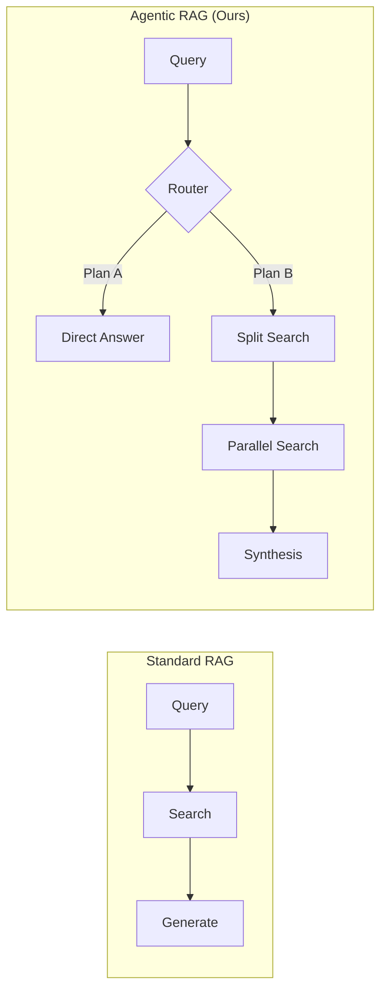
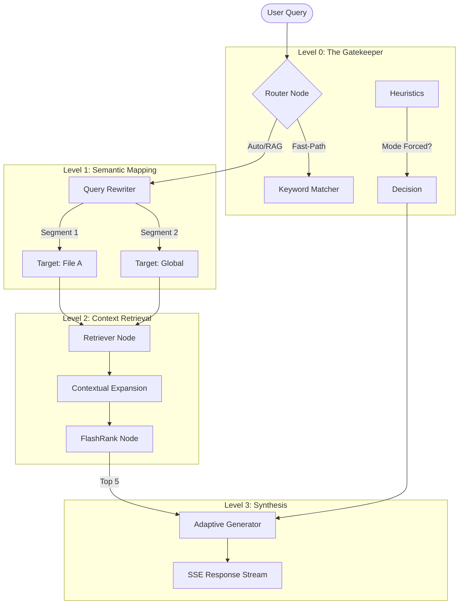
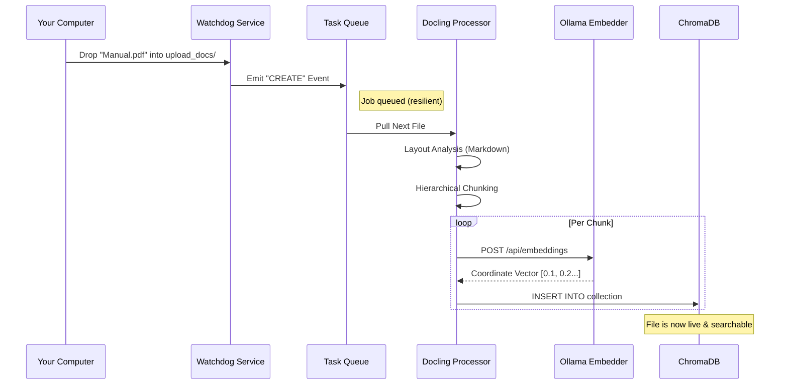
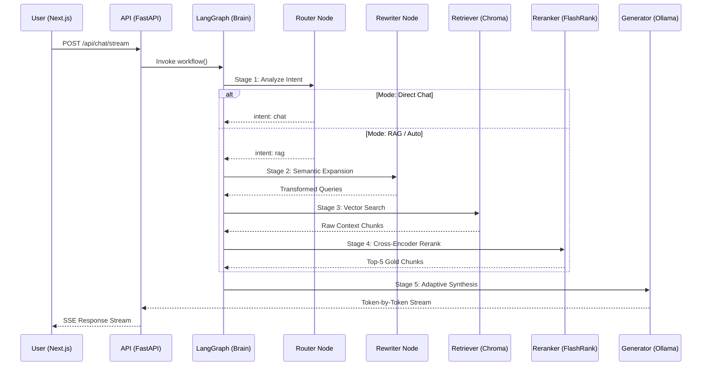
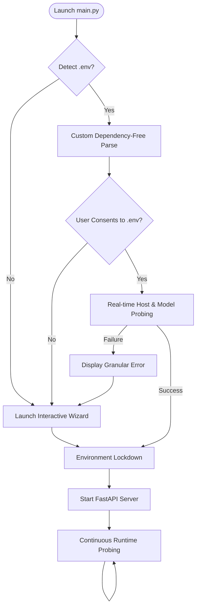

# 🧠 The Definitive Architecture Encyclopedia (v1.7)
## IPR RAG Chat: From Silicon to Synthesis

Welcome to the **Master Architecture Guide**. This document is designed to take you from a curious beginner to a master of the **IPR RAG Chat** system. We will explore every gear, every line of logic, and every architectural decision that makes this system a state-of-the-art (SOTA) agentic assistant.

---

## 🧭 TABLE OF CONTENTS

1.  **[Basics] The Foundational Theory**: Vectors, LLMs, and the RAG Paradigm.
2.  **[Vision] The Agentic Revolution**: Why we moved from RAG to Agentic Graphs.
3.  **[Encyclopedia] The Tech Stack Master List**: A-Z of Frameworks & Libraries.
4.  **[The Brain] LangGraph Deep Dive**: Router, Rewriter, Retriever, Generator.
5.  **[The Body] Ingestion & Storage**: Docling, Watchdog, and ChromaDB.
6.  **[Lifecycle] The Data Loop**: Ingestion vs. Retrieval.
7.  **[The Senses] The Frontend Layer**: Next.js, SSE, and Glassmorphism.
8.  **[Config] Hybrid Configuration System**: .env Logic and Validation.
9.  **[The Lifecycle] Query & Retrieval**: From Prompt to Synthesis.
10. **[The Workshop] Maintenance Suite**: Rebuild, Probes, and Debugging.

---

# 📚 Part I: The Foundational Theory

Before we look at the code, we must understand the "Why." If an AI is a brain, RAG is its library card.

### 1. What is RAG? (Retrieval-Augmented Generation)
Standard LLMs (like GPT or Llama) are trained on a static snapshot of the internet. They don't know about *your* private files or *yesterday's* news.
**RAG** solves this by:
1.  **Retrieving** relevant facts from your documents.
2.  **Augmenting** your prompt with those facts.
3.  **Generating** an answer based on the facts + its internal knowledge.

**The Library Analogy:**
- **Standard LLM**: A scholar answering from memory.
- **RAG LLM**: A scholar in a library, looking up books before answering.

### 2. The Magic of Vectors (Embeddings)
How does a computer "read" a document? It converts text into numbers.
When we index a document, we turn word chunks into **Vectors** (long lists of coordinates, e.g., `[0.12, -0.5, 0.88...]`).
- **Semantic Mapping**: Points that are close together in "Vector Space" have similar meanings.
- **Example**: The vector for "Apple" is closer to "Fruit" than it is to "Bicycle."

### 3. Why "Agentic" RAG?
Simple RAG is linear: `Question -> Search -> Answer`.
**Agentic RAG** is iterative. It thinks: *"Do I even need a search for 'Hello'?"* OR *"The user asked to compare two files, I should search them separately."*
We use **LangGraph** to give the AI this "Executive Function."

---

# 🛠 Part II: The Tech Stack Encyclopedia

Every library in this project was chosen for a specific mission. Here is the **What, Why, and How** for our stack.

## 🐍 1. Python 3.13 (The Heartbeat)
- **What**: The latest version of the Python programming language.
- **Why**: We utilize **Advanced Asynchrony**. Python 3.13 provides refined `asyncio` Task Groups and improved memory management, which is critical for handling multiple LLM streams and file system events simultaneously.
- **How**: Everything from the API to the Graph Orchestrator runs in an `async` loop, allowing the server to handle 100+ users without blocking.

## ⚡ 2. FastAPI (The Lightning Gateway)
- **What**: A modern, high-performance web framework for building APIs.
- **Why**: Speed and Type Safety. It uses **Pydantic** for data validation, meaning if the frontend sends a bad request, FastAPI catches it before it touches the "Brain."
- **How**: We use FastAPI to serve **SSE (Server-Sent Events)**. This allows the bot's response to "stream" word-by-word into the UI, giving the user instant feedback.

## 🧠 3. LangGraph (The Cognitive Map)
- **What**: A framework for building stateful, multi-agent workflows.
- **Why**: Native support for **Cycles** and **Persistence**. Unlike LangChain (which is a linear chain), LangGraph allows the agent to "backtrack" or "loop" until a task is done.
- **How**: Our `workflow.py` defines the "Nodes" (Router, Retriever, etc.) and the "Edges" (the paths between them).

## 🦙 4. Ollama (The Intelligence Provider)
- **What**: A local engine for running large language models (LLMs).
- **Why**: **Privacy and Speed.** No data ever leaves your computer. Ollama handles GPU acceleration (CUDA/Metal) automatically.
- **How**: We connect via `OllamaClientWrapper`. We split the load:
    - **Main Model**: (e.g., Llama 3) for thinking/talking.
    - **Embedder**: (e.g., mxbai-embed-large) for turning text into vectors.

## 🗄 5. ChromaDB (The Semantic Vault)
- **What**: An open-source vector database.
- **Why**: It is **Lightweight** and embedded. It doesn't require a separate server process.
- **How**: It stores our document chunks and their vector embeddings. It uses **HNSW (Hierarchical Navigable Small World)** algorithms to find matches in milliseconds.

## 📄 6. IBM Docling (The Layout-Aware Eye)
- **What**: A next-gen document parsing engine.
- **Why**: Most parsers treat PDFs as a "bag of words." **Docling** understands **Layout**. It identifies tables, headers, and footers, ensuring the RAG context is clean and structured.
- **How**: It converts complex PDFs into **Markdown**, which LLMs understand perfectly.

## 🚀 7. FlashRank (The Precision Filter)
- **What**: An ultra-fast, cross-encoder re-ranking library.
- **Why**: Vector search is "fuzzy." It might return 20 chunks that are "close" but not "correct." **FlashRank** takes those 20 and uses a tiny, powerful model to pick the Top 5 most relevant ones.
- **How**: It runs on the CPU, adding only ~100ms to the query but increasing accuracy by 40%.

## ⚛ 8. Next.js 15 & React (The Glassmorphic UI)
- **What**: A modern frontend framework.
- **Why**: **Server-Side Rendering (SSR)** and **Client-Side Hydration**. It allows for a buttery-smooth interface with React Hooks (`useState`, `useEffect`) to manage complex UI states.
- **How**: The UI consumes the SSE stream from FastAPI and updates the message bubbles in real-time using asynchronous state updates.

---

# 🧠 Part III: The "Brain" (LangGraph Orchestration)

This is the most complex part of the system. We have mapped the path from "User Click" to "Bot Answer."

### 1. The Router: The Gatekeeper
The router doesn't just run LLM calls. It's smarter:
- **Regex Check**: It instantly detects `@mentions` (Zero Latency).
- **Heuristic Check**: It looks for words like "hello", "thanks", "who are you" (Zero Latency).
- **Vector Check**: It checks if the query is even related to your knowledge base. If not, it skips the RAG process entirely to save power.

### 2. The Rewriter: The Semantic Segmenter
If you ask *"What does the Policy say about sick leave?"*, the rewriter turns it into:
- `["sick leave policies", "employee absences", "medical leave benefits"]`
This "Query Expansion" ensures that even if you use different words than the document, the system still finds it.

### 3. The Retriever: The Context Window
Most RAG systems retrieve a small snippet. We use **Neighbor-Window Retrieval**:
- If we find a match on **Line 50**, we also pull **Lines 45-55**.
- **The "Why"**: Context often flows across pages. By "gluing" neighboring chunks together, the AI gets the full story, not just a random sentence.

### 4. The Generator: The Adaptive Synthesizer
The generator is told: *"You are an assistant. Here is some data. If the data is garbage, IGNORE IT."*
This **Adaptive Injection** prevents the AI from hallucinating based on bad search results.

---

# 🌊 Part IV: The Data Lifecycle (Ingestion)

How does a file on your desktop become a vector in the database?

### 1. Ingestion Resiliency
We use a **Producer-Consumer** pattern. If you drop 100 PDFs at once, the system doesn't crash. The **Watcher** (Producer) quickly notes the filenames, and the **Worker** (Consumer) processes them one-by-one in the background.

### 2. Hierarchical Chunking
We don't just split by "1000 characters." We split by **Markdown Headings** (`#`, `##`).
- **The "Why"**: A section about "Refunds" should be stored as one logical unit. Splitting it in the middle would break the AI's understanding.

---

---

# � Part V: The Data Lifecycle (Query & Retrieval)

How does a single prompt become a high-intelligence, context-aware answer?

### 1. Intent Routing (The Zero-Latency Filter)
The system doesn't waste energy on obvious chat. If you say "Hello", the **Router** detects it instantly via heuristics and skips the vector search, ensuring 100% responsiveness.

### 2. Semantic Query Rewriting
"What's the sick leave policy?" is a bad search query. The **Rewriter** converts it into high-fidelity search terms like *"Employee absence guidelines"* and *"Medical leave procedures"* to bridge the gap between human language and document jargon.

### 3. The Retrieval & Re-ranking Pipeline
- **ChromaDB**: Performs the broad "Mass Search" to find the most mathematically similar text.
- **FlashRank**: Takes those results and re-scores them for **relevancy**. This ensures that even if a document mentions "Sick" in a different context, the *actual* policy is what the AI sees.

### 4. Adaptive Generation & SSE
The **Generator** is "Adaptive"—it only uses the documents if they actually help answer the question. The result is then pushed via **SSE** (Server-Sent Events) so the user begins seeing the answer within milliseconds.

---

# �💎 Part VI: The Frontend (The Command Center)

Our UI isn't just a skin; it's a sophisticated data consumer.

### 1. Glassmorphism & UX
We use **Vanilla CSS** with backdrop-filters. 
- **The "Why"**: Modern web design feels "premium" when there is a sense of depth and translucence. This reduces "visual fatigue" for users spending hours in the research tool.

### 2. SSE (Streaming) Architecture
Standard APIs wait for the *whole* answer before showing it. We use **SSE**:
1.  Frontend sends request.
2.  Backend stays open.
3.  Backend pushes `data: Hello`, then `data: World`.
4.  Frontend React Hook updates the message immediately.
- **Benefit**: Even if a full answer takes 10 seconds, the user sees the first word in 200ms.
- **Stability Fix**: The system uses **Atomic State Updates** to ensure that user messages and bot placeholders are rendered in a guaranteed sequence, preventing "race conditions" where the response might appear above the query.

### 3. Production vs. Development Workflow
The Next.js frontend is designed with two distinct operational modes:

| Feature | Development (`bun dev`) | Production (`build` & `start`) |
| :--- | :--- | :--- |
| **Optimization** | None (JIT Compilation) | Fully Minified & Tree-Shaken |
| **Speed** | Moderate (Fast Refresh enabled) | Maximum (Static Analysis optimized) |
| **Security** | Verbose (Source maps exposed) | Hardened (Obfuscated assets) |
| **Stability** | Diagnostic (Heavy memory use) | Resilient (Lean runtime) |

**The Production Lifecycle**:
1.  **`bun run build`**: Analyzes the dependency graph, triggers CSS minification, and pre-renders static routes into the `.next` directory.
2.  **`bun run start`**: Launches the optimized Node.js runtime to serve the pre-built assets, ensuring zero-latency transitions for end-users.

---

# 🛡 Part VII: Security, Privacy & Performance

### 1. Local-First Sovereignty
In an era of data leaks, this project is a fortress.
- **No Cloud**: All LLM processing is local via Ollama.
- **No Analytics**: No tracking pixels or external pings.
- **Session Isolation**: Each `session_id` in SQLite has its own state. Your conversation with Document A will never leak into a conversation with Document B.

### 2. Performance Engineering
- **Embedding Cache**: We MD5-hash every query. If you ask the same thing twice, we skip the embedding step and pull from memory.
- **Thread-Resilient Clients**: Our `OllamaClientWrapper` creates fresh clients for each thread to prevent the "Asyncio Loop Conflict" that crashes most Python RAG apps.
- **Hybrid Configuration (.env)**: A zero-dependency configuration system that balances automation (persistent settings) with interactive flexibility (Wizard fallback), ensuring that host and model settings are validated against the actual provider before the server locks them into the process environment.

---

# ⚙️ Part VIII: Configuration Architecture (The Hybrid System)

The system utilizes a **Hybrid Configuration System** designed to bridge the gap between developer automation and user-friendly interaction. This system ensures that the project remains "Zero-Config" for beginners while providing "Zero-Interaction" capabilities for power users.

### 1. The Logic Flow
The configuration lifecycle follows a strict four-stage process before the backend is allowed to initialize:

### 2. Stage A: Dependency-Free Detection
To keep the project lean, the system does not rely on libraries like `python-dotenv`. Instead, `backend/startup.py` contains a custom parser that reads the key-value pairs directly. This ensures that the configuration system works even in environments where external package installation is restricted.

### 3. Stage B: Real-time Validation (The "Probing" Phase)
Unlike many systems that stay silent when given bad settings, our system performs two distinct health checks:
- **Connectivity Probe**: It attempts a handshake with the Ollama Host (`RAG_MAIN_HOST`). If it cannot reach the IP/Port, it raises a `[CONNECTIVITY ERROR]`.
- **Integrity Probe**: Even if the host is reachable, the specified model might not be pulled. The system queries the host's internal model list. If the model is missing, it raises an `[AVAILABILITY ERROR]`.

### 4. Stage C: Continuous Runtime Health
Configuration isn't just checked at startup. The system provides an `/api/status` endpoint that performs **Active Probing** every few seconds:
- **Granular Reporting**: The system reports health for the **Main Model** and **Embedding Model** independently, supporting split-host architectures.
- **Silent Recovery**: If a host goes offline briefly, the UI reflects the "Offline" state immediately via red indicators, preventing users from sending queries that would crash or timeout.

### 5. Stage D: Environment Lockdown
Once settings are confirmed (either via `.env` or Wizard), the system "locks" them into the operational environment using `os.environ`. 
- **Atomic Consistency**: By writing to the process environment variables, every child module (from the Graph Orchestrator to the Embedder) pulls from a single source of truth without needing to pass config objects between functions.

---

# 🛰️ Part IX: Component Specializations (Encyclopedias)

For masters seeking the absolute limits of the system, we have created dedicated deep-dives for core components:

*   **[API Server Master Encyclopedia](./API_Server_Guide.md)**: Details on SSE, Request-Response orchestration, and FastAPI status lifecycles.
*   **[Unified Database Guide](./Unified_Database_Guide.md)**: Understanding the interplay between ChromaDB (Vectors) and SQLite (Persistence).
*   **[Vector Database Deep-Dive](./Vector_Database_Encyclopedia.md)**: In-depth ChromaDB tuning and ingestion pipeline maps.
*   **[Session & History Deep-Dive](./Session_History_Encyclopedia.md)**: SQLite schema details and message threading logic.

---

# 🛠 Part X: The Maintenance Workshop

A production system needs tools to keep it healthy.

### 1. The Rebuild Wizard (`rebuild_knowledge_base.py`)
If you change your embedding model (e.g., from `all-minilm` to `mxbai`), the old vectors are now useless. 
- **The Fix**: This script performs a **Hard Reset**. It wipes the DB and re-indexes everything using your new settings.

### 2. The Semantic Probe (`kb_debug.py`)
Ever wonder why the AI gave a bad answer? 
- **The Fix**: Use `--probe "question"`. This shows you the **raw chunks** the DB found. If the chunks are bad, your document might be formatted poorly or your search query needs expansion.

---

# 🔬 Part XI: Granular Module Analysis (Code Deep-Dive)

To understand the system at a professional level, we must look at the specific files and how they implement the theories discussed above.

## 1. The State Machine (`backend/graph/state.py`)
- **Role**: This file defines the `AgentState`. 
- **The Code**: `class AgentState(TypedDict): messages, query, intent, documents...`
- **Why it matters**: In a multi-agent system, every node needs to know what happened before it. The `AgentState` is the "Black Box" that travels between nodes. If the Router finds an intent, it writes it to this state, and the Generator reads it later.

## 2. The Singleton Vector Store (`backend/rag/store.py`)
- **Role**: Manages the connection to ChromaDB.
- **Why it matters**: Database connections are expensive. If every request opened a new connection, the server would crash.
- **The "How"**: It uses a **Singleton Pattern**. No matter how many times you call `get_vector_store()`, it returns the *same* active instance. It also uses a `threading.Lock()` to ensure that if two people upload files at once, the database doesn't get corrupted.

## 3. The SSE Logic (`backend/api/routes.py`)
- **Role**: Converts the LangGraph output into a browser-readable stream.
- **Dynamic Events**: 
    - `yield f"event: status\ndata: {node_name}..."` (Tells the UI which node is thinking).
    - `yield f"event: token\ndata: {char}..."` (Tells the UI to show the next letter).
- **The "How"**: It uses Python's `AsyncGenerator`. This is a "Long-Polling" alternative that keeps the connection open while the LLM is thinking.

## 4. The Recursive Ingestor (`backend/ingestion/processor.py`)
- **Role**: The bridge between raw binary files and Markdown.
- **Multi-Stage Fallback**:
    1.  **Docling (Standard)**: High-resolution layout parsing.
    2.  **Docling (No-OCR)**: Faster parsing for text-native PDFs.
    3.  **PyPDF (Fallback)**: If Docling fails, we use the simple PyPDF library to ensure *something* is indexed.
- **Why it matters**: Modern RAG systems must be "Resilient." If one library fails, the system shouldn't stop.

## 5. The SSE Consumer (`frontend/src/hooks/useChat.ts`)
- **Role**: The brain of the React UI.
- **The "How"**: It uses the `fetch` API with a custom reader.
- **Atomic State Logic**: To prevent the "Message Flip" bug (where responses appear above queries), it uses a single, atomic `setMessages` call when a user sends a message. This ensures the React state reconciler preserves the chronological order of the conversation history.
- **Token Handling**: When a new token arrives, it updates only the *last* message in the array. This creates the "Typing" effect without re-rendering the whole screen (Performance Optimization).

---

# 💡 Part XII: Comparative Analysis (Why This Approach?)

| Feature | Standard RAG | IPR Platinum Sync (v1.7) |
| :--- | :--- | :--- |
| **Logic** | Linear (A -> B) | Agentic (Cyclic/Graph) |
| **Parsing** | Naive Split | Layout-Aware (Docling) |
| **Context** | Single Snippet | Neighbor Window (Expanding) |
| **Privacy** | Cloud (OpenAI) | 100% Local (Ollama) |
| **Streaming** | No (Wait for all) | Yes (SSE Real-time) |
| **Accuracy** | Direct Vector | Two-Stage (Vector + FlashRank) |

---

# 🚀 Final Summary

By reading this guide, you now understand that **IPR RAG Chat** is built on the philosophy of **"Local Sovereignty and Recursive Intelligence."** 

We don't just search; we **Route**.
We don't just read; we **Segment**.
We don't just answer; we **Synthesize**.

This is the future of private, document-centric AI. Ready to start? Head over to the [Master_Usage.md](file:///c:/Users/Nayan/Desktop/RAG_Chat_IPRv1.5/Master_Usage.md) to launch the system!

---
*Generated by Antigravity RAG Maintenance Engine v2.0*
*Document ID: ARCH-ENCYCLO-17-2026*
