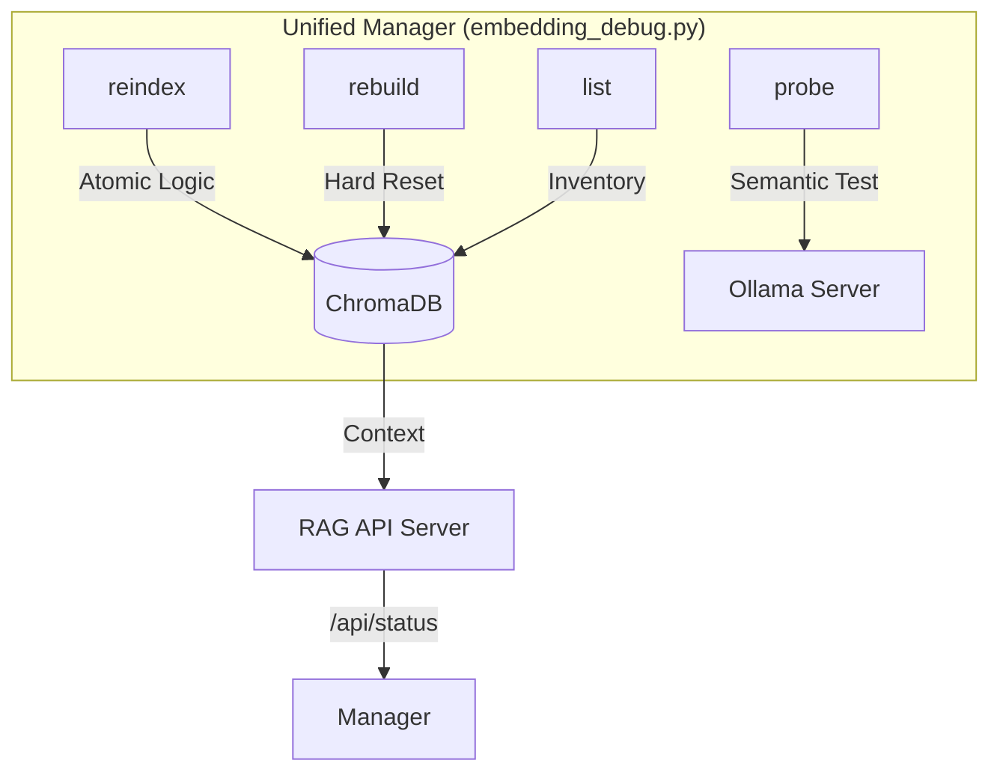

# 🛠️ Debugging & Maintenance Suite: Unified Guide

This document provides a comprehensive overview of the **Unified Embedding Debug Manager** (`embedding_debug.py`). This tool is the single "Source of Truth" for maintaining, inspecting, and repairing the Knowledge Base (Vector Database).

---

## 🏗️ Architecture

The suite consolidates multiple legacy pillars into a single high-fidelity interface.



---

## 🧹 1. Fresh Start Reset (`rebuild`)

Use this command when switching embedding models or resolving deep metadata corruption. It performs a "Hard Reset" of the system.

### ⚙️ How it works:
1.  **Config Detection**: Explicitly loads `.env` for host/model settings.
2.  **Hard Purge**: Wipes the ChromaDB collection entirely.
3.  **Noise Reduction**: Automatically ignores hidden files (`.gitkeep`) and temporary system files (`~$...`).
4.  **Optimized Ingestion**: Triggers the **Docling** pipeline with batch-embedding for maximum speed.

### 🚀 Usage:
```bash
uv run python embedding_debug.py rebuild
```

---

## 🔄 2. Atomic Selective Re-indexing (`reindex`)

The most advanced maintenance feature. It allowing you to update specific files without wiping the entire library.

### ⚙️ How it works:
1.  **Atomic Deletion**: First, it identifies and deletes all existing chunks for the specified filename.
2.  **Fresh Construction**: It re-processes the file from scratch using the full production pipeline, ensuring no duplicate or orphaned chunks remain.

### 🚀 Usage:
```bash
uv run python embedding_debug.py reindex path/to/document.pdf
```

---

## 🔍 3. System Inspection (`list` & `probe`)

### 📋 Inventory Mode (`list`)
Lists every document in your vector database with accurate chunk counts.

**Usage:**
```bash
uv run python embedding_debug.py list
```

---

### 🎯 Semantic Probe Mode (`probe`)
Allows you to run a search query and see the **raw chunks** and **distance scores** from ChromaDB before they reach the LLM.

**Usage:**
```bash
uv run python embedding_debug.py probe "your search query"
```

---

## 🛡️ Robustness Features

1.  **Extension Whitelisting**: The system silently ignores unsupported file formats, preventing log noise.
2.  **Fail-Fast Configuration**: If `.env` is misconfigured, the tool exits immediately with a diagnostic message rather than using silent local defaults.
3.  **HPC Ready**: Designed to handle both local and remote (HPC) Ollama instances seamlessly.

---


