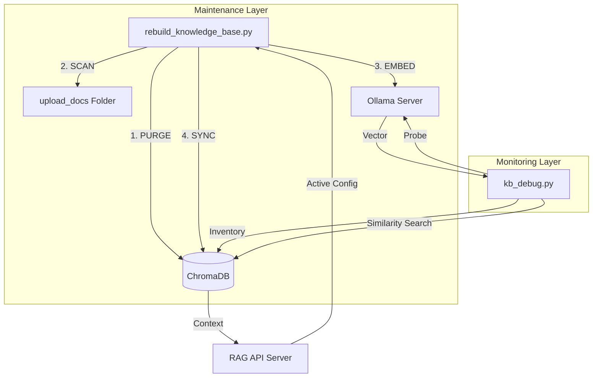
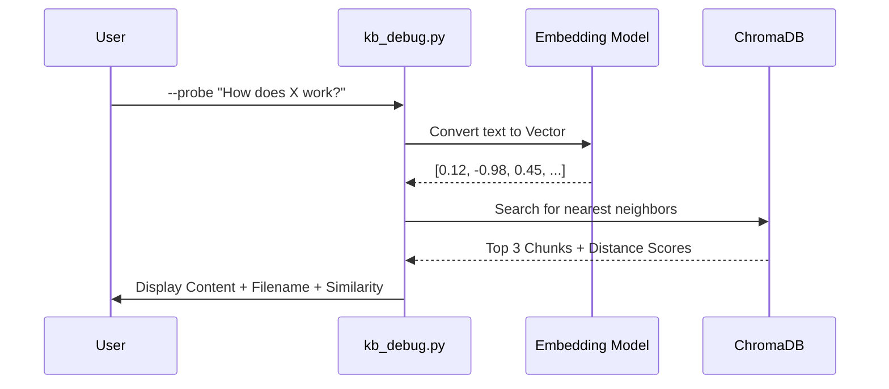

# 🛠️ Debugging & Monitoring Suite: Technical Guide

This document provides a comprehensive overview of the **Knowledge Base Maintenance Suite**. These utilities are designed to ensure your RAG (Retrieval-Augmented Generation) system remains high-fidelity, accurate, and manageable.

---

## 🏗️ Suite Architecture

The suite consists of two primary pillars: **Fresh Start Logic** and **Semantic Inspection**.



---

## 🧹 1. Fresh Start Reset (`rebuild_knowledge_base.py`)

This utility is used when you want to "nuke" the existing database and start from a clean slate. It is essential when switching embedding models or resolving deep metadata corruption.

### ⚙️ How it works:
1.  **Auto-Discovery**: It pings the running API at `localhost:8000` to detect your active **Host** and **Embedding Model**. This ensures your rebuild perfectly matches your UI settings.
2.  **Hard Purge**: It physically deletes the `chroma_db` directory (`shutil.rmtree`). This removes all old shards, indexes, and legacy metadata.
3.  **Recursive Ingestion**: It iterates through the `upload_docs` directory, utilizing the production-grade `DocumentProcessor` (Hierarchical + Section-aware chunking).
4.  **Optimized Batching**: Chunks are sent to Ollama in optimized batches to maximize speed while preventing timeout errors.

### 🚀 Usage:
```bash
python rebuild_knowledge_base.py
```

### 📊 Terminal Output Example:
| FILE | CHUNKS | STATUS |
| :--- | :--- | :--- |
| Policy_Manual.pdf | 42 | ✅ Indexed |
| Tech_Specs.docx | 15 | ✅ Indexed |
| corrupt_file.tmp | 0 | ⚠️ Skipped |

---

## 🔍 2. System Inspector (`kb_debug.py`)

The debugger provides transparency into the "Black Box" of vector retrieval.

### 📋 Inventory Mode (`--inventory`)
Lists every document currently living in your vector database.

**What it exposes:**
- **Chunk Density**: How many pieces a file was sliced into.
- **Persistence Check**: Ensures the database actually contains what you think it does.

**Usage:**
```bash
python kb_debug.py --inventory
```

---

### 🎯 Semantic Probe Mode (`--probe`)
This is the most powerful tool for RAG debugging. It allows you to run a search query and see exactly what segments are being retrieved **before** they reach the LLM.



**Why use it?**
- **Distance Scores**: If the "Distance" is high (e.g., > 1.5), the retrieval is poor. You might need better documents or a different embedding model.
- **Segment Inspection**: Check if your chunking strategy is cutting off important information mid-sentence.

**Usage:**
```bash
python kb_debug.py --probe "your search query here"
```

---

## 💡 Troubleshooting & Best Practices

1.  **API Consistency**: Always ensure your API server is running when you run the rebuild script. It helps the script "inherit" your preferred model settings (Set via `.env` or the Wizard).
2.  **Space Handling**: If your filenames have spaces or special characters, the suite uses normalized metadata IDs to ensure they remain searchable.
3.  **Memory Management**: If you are indexing 100+ documents, monitor your system RAM. The `kb_debug --inventory` command fetches all metadata into memory for the report.
4.  **Proactive Health Checks**: The system now verifies both host ping AND model pull status. If `rebuild_knowledge_base.py` fails to start, verify your settings in the UI or `.env` and ensure the models are available on the specific hosts.

---
*Generated by Antigravity RAG Maintenance Engine v2.0*
