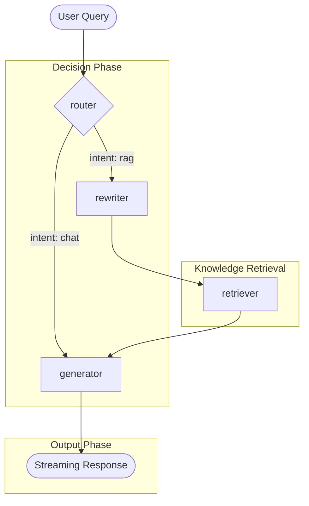
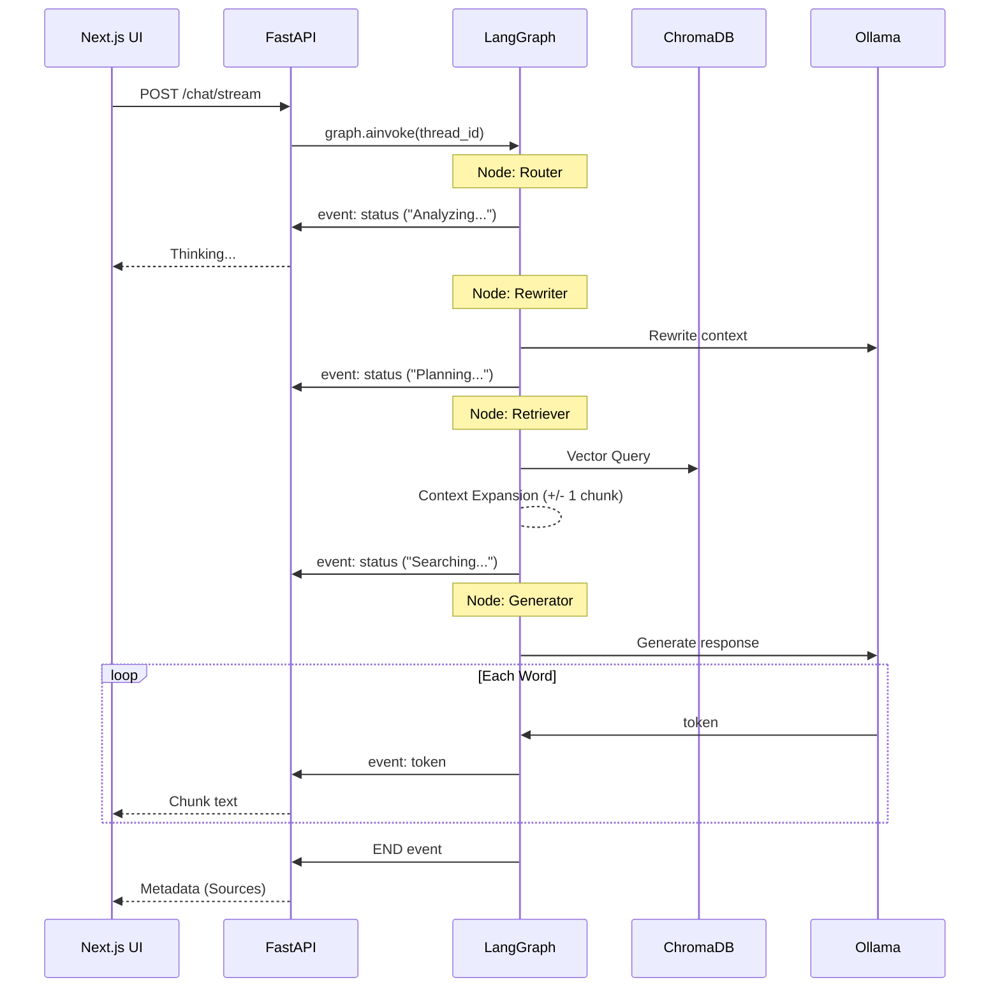
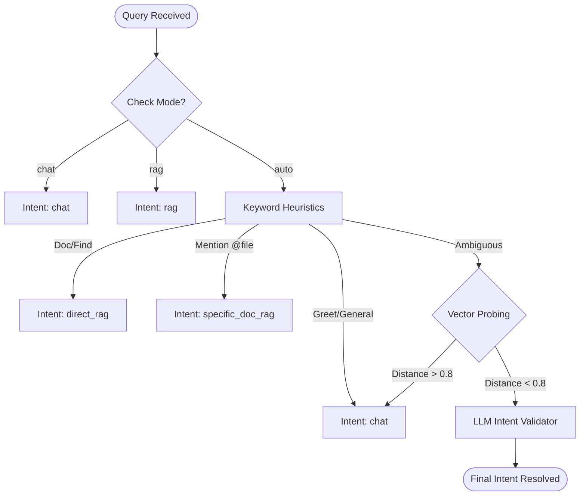
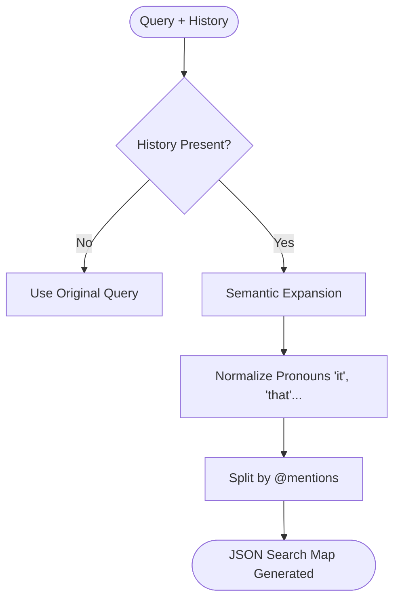
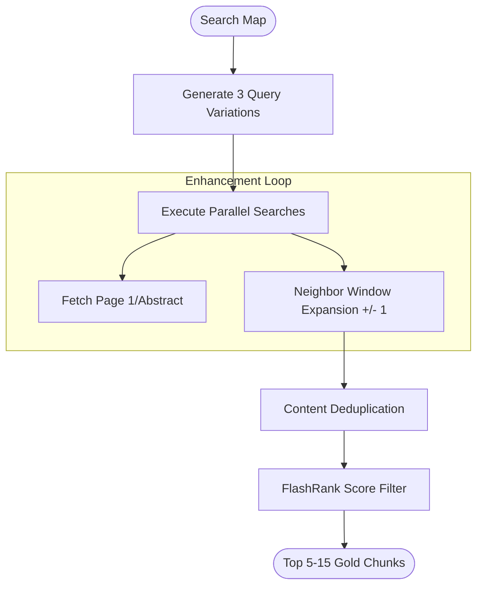
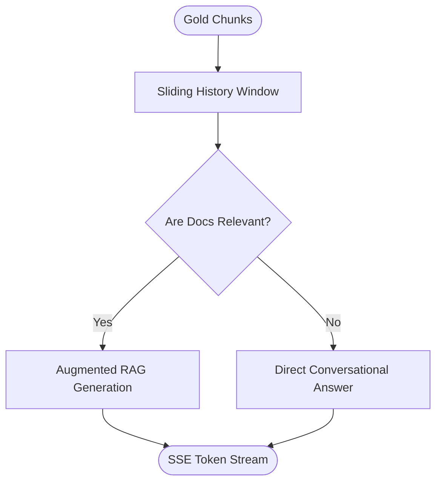
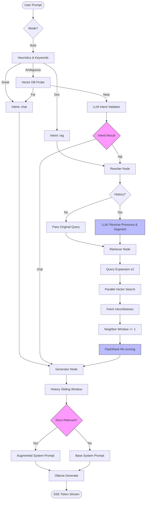
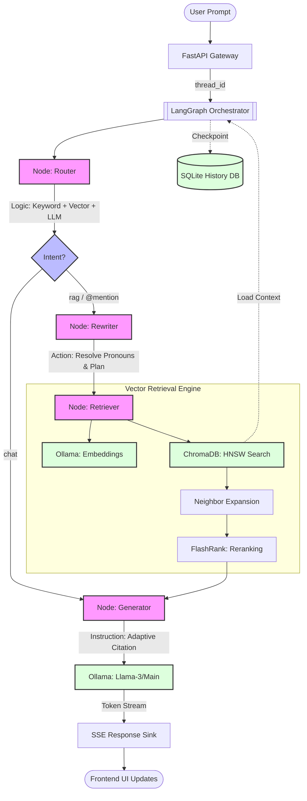
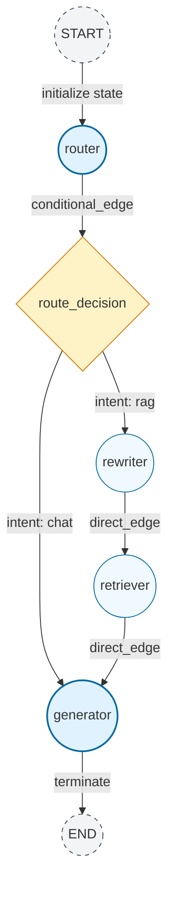

# 🧠 LangGraph Deep-Dive: The "Neural" Core of IPR RAG Chat v1.7

This document is an exhaustive, step-by-step guide to how **LangGraph** orchestrates the "thinking process" of this system. It covers everything from basic state management to the advanced asynchronous streaming logic that connects the LLM, the Vector Store, and the Frontend.

---

## 🧭 Table of Contents
1.  **[Introduction] Why LangGraph?**
2.  **[Basics] The Foundational Concepts**
3.  **[The State] AgentState: The Shared Memory**
4.  **[The Graph] Workflow Architecture (Nodes & Edges)**
5.  **[Deep Dive] The Logic Nodes (Step-by-Step)**
    *   The Router (The Gatekeeper)
    *   The Rewriter (The Planner)
    *   The Retriever (The Researcher)
    *   The Generator (The Expert)
6.  **[Persistence] The SQLite Checkpointer**
7.  **[Integration] Connecting to the World**
    *   FastAPI & SSE Streaming
    *   Ollama & Model Contexts
8.  **[Visuals] The Master Process Maps**

---

## 1. 🧬 Introduction: Why LangGraph?

Standard LLM pipelines are **Linear** (A -> B -> C). If a step fails, the whole thing fails. 
**LangGraph** allows for **Cyclic** and **Stateful** logic. It treats the AI's "thought process" as a **State Machine**.

**Benefits in this project:**
- **Control**: We can force the AI to search a specific file using `@mentions`.
- **Efficiency**: We skip the "Knowledge Base" entirely if the user just says "Hi".
- **Resiliency**: If one retrieval path is weak, the state allows the system to fallback gracefully.
- **Persistence**: LangGraph remembers where it was, allowing for long-running "multi-turn" conversations.

---

## 2. 🧱 Basics: The Foundational Concepts

To understand our implementation, you must know these four terms:
1.  **State**: The shared "Black Box" containing all the data (messages, documents, intent) that passes through every part of the system.
2.  **Nodes**: Specific Python functions that perform ONE job (e.g., "Find the documents").
3.  **Edges**: The pathways between nodes. 
4.  **Conditional Edges**: "If/Then" logic that directs traffic (e.g., "If intent is chat, go to Generator; Else go to Rewriter").

---

## 3. 💾 The State: `AgentState`

The `AgentState` (defined in `backend/graph/state.py`) is the single source of truth for a chat turn.

```python
class AgentState(TypedDict):
    messages: Annotated[List[BaseMessage], add_messages] # Chat History
    query: str                                         # Optimized Search Query
    intent: str                                        # 'chat', 'direct_rag', etc.
    documents: List[str]                               # The text found in files
    targeted_docs: List[str]                           # @filename tags detected
    semantic_queries: List[Dict[str, Any]]             # The "Search Plan"
    mode: str                                          # user-selected (auto/rag/chat)
```

**How it works:**
- When a node finishes its job, it returns an update to this state.
- **`add_messages`**: This is a special function. It doesn't overwrite your history; it **appends** new LLM responses to it automatically.

---

## 4. 🕸 The Graph: Workflow Architecture

The "Brain" is wired in `backend/graph/workflow.py`. It uses a `StateGraph`.

### The Connectivity Map (Mermaid):


**Logic Flow:**
1.  **Entry Point**: Every request enters via the **Router**.
2.  **Branching**: The Router decides: "Is this a simple chat or do I need data?"
3.  **Retrieval Loop**: If data is needed, we rewrite the quest, fetch it, and then hand it to the generator.
4.  **Termination**: The generator always ends the graph.

---

## 5. 🔬 Deep Dive: The Logic Nodes

### A. The Router (The Gatekeeper)
*File: `backend/graph/nodes/router.py`*

The Router is designed for **Zero-Latency Accuracy**. It uses a three-tier check:
1.  **Regex Check**: Instantly detects `@mentions` (e.g., "What's in @Policy.pdf?").
2.  **Heuristic Check**: Scans for 50+ keywords (e.g., "write", "code", "hello") to identify "Casual Chat".
3.  **Semantic Check**: If Tier 1 & 2 are unsure, it pings the Vector DB. If search results are > 0.8 distance (very far), it assumes it's a general question and routes to **Chat**.

### B. The Rewriter (The Planner)
*File: `backend/graph/nodes/rewriter.py`*

User prompts are often vague. The Rewriter is an LLM agent that thinks: *"How do I search for this?"*
- **Pronoun Resolution**: Turns "Tell me about it" into "Tell me about the [Insurance Policy X]".
- **Semantic Segmentation**: If you mention two files, it creates two separate search queries, one for each file.
- **Search Metadata**: It identifies which sections (Introduction, Technical Spec) the user likely wants.

### C. The Retriever (The Researcher)
*File: `backend/graph/nodes/retriever.py`*

The most complex node in the project. It doesn't just search; it **investigates**.
1.  **Embedding cache**: Uses a SHA-256 hash to skip LLM calls for identical queries.
2.  **Context Window Expansion**: If it finds a match on "Page 5", it automatically pulls "Page 4" and "Page 6" to provide full context.
3.  **Intro-Fetcher**: For targeted files, it always pulls the first 3 chunks (Abstract/Headers) to ensure the LLM knows the "Scope" of the file.
4.  **Reranking (FlashRank)**: It takes 20+ "mathematical matches" and uses a tiny, fast cross-encoder to pick the **Top 5 human-relevant ones**.

### D. The Generator (The Expert)
*File: `backend/graph/nodes/generate.py`*

The final stage. It is **Adaptive**.
- **Context Injection**: It wraps retrieved documents in `<knowledge_base>` tags.
- **Instruction Tuning**: Tells the LLM: *"If the documents don't answer the question, don't lie. Just chat normally."*
- **Sliding Window**: It trims old messages to prevent the "Context Overflow" that makes LLMs slow and forgetful.

---

## 6. 🔒 Persistence: The SQLite Checkpointer

LangGraph doesn't forget sessions when the script ends. We use the **`SqliteSaver`**.

**How it works:**
1.  Every conversation is given a `thread_id` (the Session ID).
2.  When the graph moves between nodes, LangGraph saves a "Snapshot" of the `AgentState` to `rag_chat_sessions.db`.
3.  **The "Magic"**: If the server crashes or restarts, we simply pass the `thread_id` back in, and LangGraph "rehydrates" the brain exactly where it left off.

---

## 🔌 7. Integration: Connecting to the World

### A. FastAPI & SSE (The Data Pipeline)
LangGraph doesn't work in a vacuum. `backend/api/routes.py` is the bridge.
- **Event Listening**: We use `graph.astream_events(...)`. 
- **Status Updates**: As the graph hits a new node, the API emits `event: status`. This is why you see "Searching Documents..." in the UI exactly when LangGraph hits the Retriever node.
- **Token Streaming**: Tokens from the `generator` node are caught and yielded as `event: token` in real-time.

### B. Ollama (The Engine)
We use a **Split-Provider Architecture**:
- **Chat Client**: Powers the Router (Intent), Rewriter (Planning), and Generator (Talking).
- **Embedding Client**: Powers the Retriever (Searching) and the Router's vector check.
- **Host Independence**: LangGraph nodes can talk to different Ollama hosts for Main and Embedding models simultaneously (Split-Host Support).

---

## 📈 10. The Master "Full-Turn" Sequence



---

## 🚀 8. LangGraph Execution Flow: The Deep Dive

Every turn in the conversation follows a strictly orchestrated lifecycle. Below we break down exactly what happens inside each node and how the "Edges" decide where the data goes next.

### 📍 Node 1: The Router (Intent Detection)
The **Router** is the entry point. Its mission is to classify the query into one of three intents: `chat`, `direct_rag`, or `specific_doc_rag`.



### 📍 Node 2: The Rewriter (Search Planning)
If intent is RAG-based, the Rewriter takes the query and history to build a **Search Plan**.



### 📍 Node 3: The Retriever (Parallel Research)
The Retriever handles the heavy lifting of talking to the Vector DB.



### 📍 Node 4: The Generator (Adaptive Synthesis)
The final stage transforms raw data into a human-grade answer.



### 📍 The Interconnected Execution Map
This diagram merges the detailed logic of all nodes to show exactly how data travels and decisions are made from the moment a prompt enteres the system until the answer is generated.



---

## 🗺️ 9. The Master Orchestration Graph

This is the final "Big Picture" showing how every component, node, and conditional edge connects to make the project work end-to-end.



---

## 🔄 10. End-to-End Workbook: From Click to Answer

1.  **Request Initiation**: The user types a question in the Next.js UI.
2.  **API Handshake**: FastAPI receives the request and initializes the LangGraph instance with the current `thread_id`.
3.  **State Initialization**: The `AgentState` is populated with the new message and the user's selected mode.
4.  **Intent Arbitration**: The **Router** (Node 1) decides if we need to search. It saves the `intent` to the state.
5.  **The Fork**:
    *   If `chat`: Goes straight to **Generator**.
    *   If `rag`: Goes to **Rewriter** (Node 2) to build a search map.
6.  **Context Loading**: The **Retriever** (Node 3) queries ChromaDB, expands the window, reranks the hits via FlashRank, and saves the `documents` to the state.
7.  **Final Drafting**: The **Generator** (Node 4) takes the state's `messages` and `documents`, builds the final prompt, and calls Ollama.
8.  **Streaming Delivery**: LangGraph emits token events that FastAPI captures and streams to the UI via SSE.
9.  **Checkpointing**: Once `END` is reached, the entire `AgentState` is serialized to SQLite, meaning the user can refresh the page and continue exactly where they left off.

---

## 🏗️ 11. The Formal State-Graph (Nodes & Edges)

This is the mathematical representation of the **IPR RAG Brain v1.7**. It highlights the specific **Edges** (Transitions) and **Conditional Paths** used by the LangGraph engine.



### Edge Glossary:
- **`START` to `router`**: Entry point where the user query is injected into the `AgentState`.
- **`router` to `generator` (Chat Path)**: Triggered when no document search is required (e.g., greetings, general code help).
- **`router` to `rewriter` (Knowledge Path)**: Triggered when the system detects RAG intent or a @mention.
- **`rewriter` to `retriever`**: Passes the "Search Map" from the planner to the researcher.
- **`retriever` to `generator`**: Passes the "Golden Chunks" to the final synthesis engine.
- **`generator` to `END`**: The final state transition that closes the SSE stream and triggers database persistence.

---
*Generated by Antigravity RAG Maintenance Engine*
*Document Standard: MASTER-LOGIC-v2.5*
