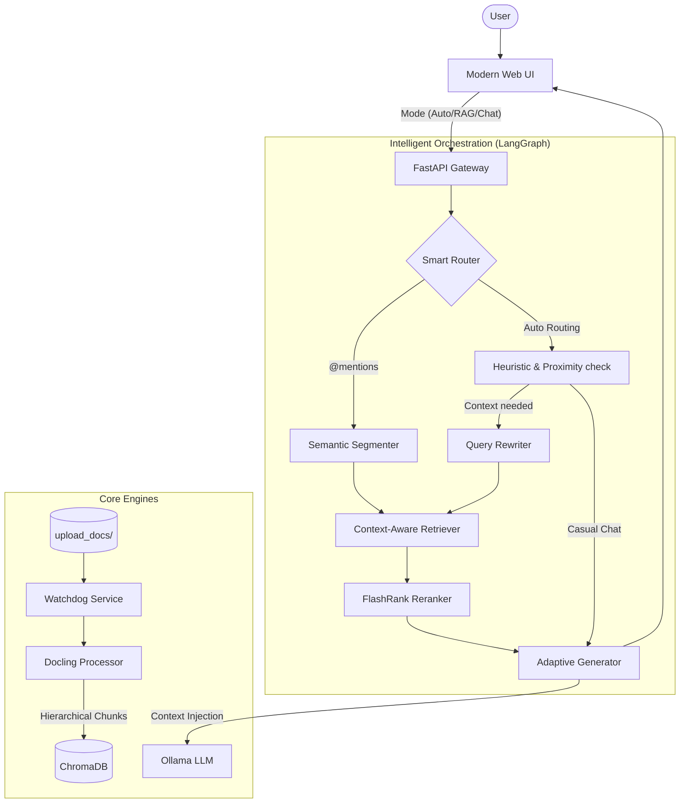

# IPR RAG Chat v1.5

A production-grade, modular, and agentic RAG (Retrieval-Augmented Generation) system. Built with **FastAPI**, **LangGraph**, **Ollama**, **Docling**, and **Next.js**.



---

## 🌟 Platinum Sync Features

*   **🕹️ Intelligence Mode Selector**: Seamlessly switch between **Auto** (Smart Intent Detection), **RAG** (Strict Knowledge Base), and **Chat** (Pure LLM) modes.
*   **🧠 Unified Session Context**: 10-turn sliding memory window ensures the AI never loses context, even when switching interaction modes.
*   **⚡ Adaptive Knowledge Injection**: The system intelligently decides *when* to inject documents into the prompt, reducing token noise and hallucinations.
*   **📍 Semantic @Mentions**: Pinpoint exactly which files the AI should read by typing `@filename` directly in the chat.
*   **🛡️ Performance Maintenance Suite**: Standalone tools for Knowledge Base integrity:
    *   **[`rebuild_knowledge_base.py`](./rebuild_knowledge_base.py)**: Total DB reset with high-fidelity progress tracking.
    *   **[`kb_debug.py`](./kb_debug.py)**: Semantic probing and inventory monitoring.
*   **📑 Hierarchical RAG**: Section-aware chunking preserves the relationship between headers and body text for surgical accuracy.
*   **💎 Premium Glassmorphic UI**: High-speed interface featuring live thinking states, source-strip transparency, and buttery animations.

## 🛠 Tech Stack

*   **Orchestration**: LangGraph (Stateful Agentic Workflow)
*   **LLM & Embeddings**: Ollama (Split-host and Batch-embedding support)
*   **Ingestion Engine**: IBM Docling (Resilient multi-stage parsing with Section-Awareness)
*   **Vector Engine**: ChromaDB (hnsw:cosine)
*   **Re-ranking**: FlashRank (ms-marco-TinyBERT-L-2-v2)
*   **Frontend**: Next.js 15, Vanilla CSS, Lucide Icons

---

## 📦 Quick Start

### 1. Prerequisites
- **Python 3.13+** & **uv**
- **Ollama** (Running & Host accessible)
- **Bun** or **Node.js**

### 2. Installation & Launch
```bash
# 1. Start Backend (Interactive Configuration Wizard)
# Hint: Copy .env.example to .env for zero-click setup!
uv run main.py

# 2. Start Frontend
cd frontend
bun install && bun dev
```

Visit **http://localhost:3000** to enter the Command Center.

---

## 📖 Component Deep-Dives
- [**Architecture & Orchestration**](./Architecture_Guide.md): Detailed logic mapping of the LangGraph nodes.
- [**API Server Encyclopedia**](./API_Server_Guide.md): Deep dive into FastAPI, SSE, and Request Lifecycles.
- [**Database Encyclopedia Suite**](./Unified_Database_Guide.md): 
    - [Vector Database (ChromaDB)](./Vector_Database_Encyclopedia.md)
    - [Session History (SQLite)](./Session_History_Encyclopedia.md)
- [**Debugging & Monitoring**](./DEBUG_SUITE_GUIDE.md): Guide to the maintenance and probing utilities.
- [**RAG Strategies**](./RAG%20Strategies.md): Technical breakdown of the ingestion and retrieval chain.
- [**Usage Guides**](./Master_Usage.md): Setup and feature documentation for end-users.
