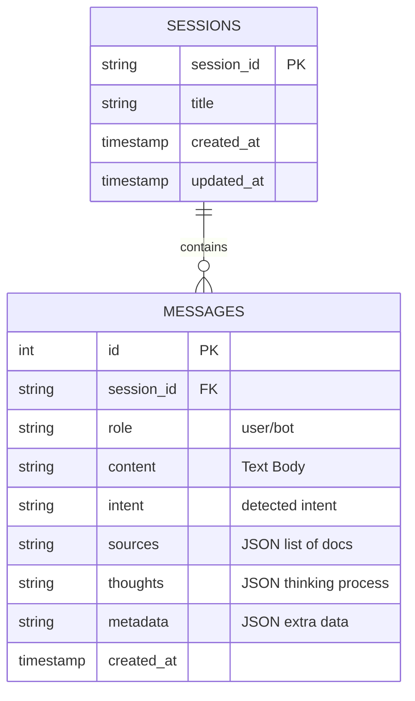
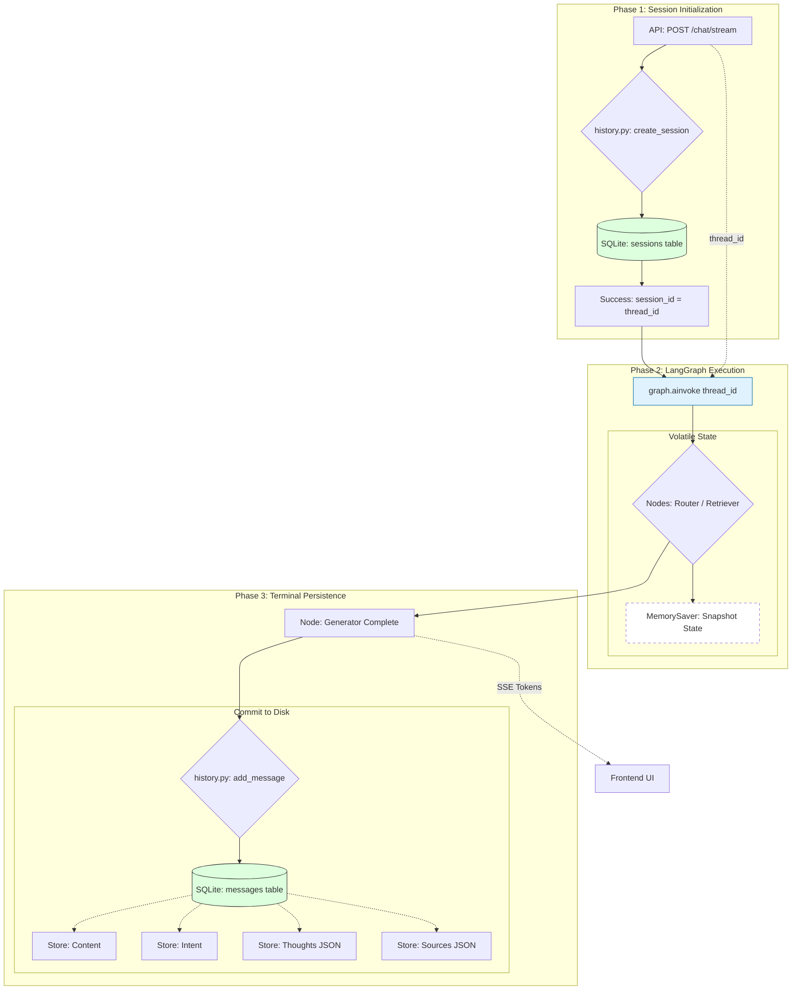

# Session & History Encyclopedia: The Heart of Conversational Continuity

This encyclopedia provides a 360-degree technical deep-dive into the **Session and Chat History Database (SQLite)** powering the **RAG Chat IPR**. It covers everything from thread-safe connections to the complex serialization of agentic thought processes.

---

## 🏛️ 1. Why SQLite? (The Choice of Stability)

For session management and chat history, we require **ACID compliance** (Atomicity, Consistency, Isolation, Durability). 

1.  **Lightweight**: SQLite is serverless and lives as a single file (`rag_chat_sessions.db`).
2.  **Relational Power**: It allows us to link millions of messages to thousands of sessions instantly.
3.  **Cross-Platform**: The DB file works anywhere without a database server installation.

---

## 📂 2. Storage & Schema Definition

- **Location**: `rag_chat_sessions.db` (Project Root).
-   **Definition**: The schema is **programmatically defined** in `backend/state/history.py`.

### The Relational Blueprint:



---

## ⚙️ 3. The Thread-Safe Connection Engine

Because the **FastAPI** backend is asynchronous and processes multiple users at once, we use a custom **Thread-Local Connection Pool** in `history.py`:

-   **`_local = threading.local()`**: Ensures that each Python thread has its own private connection to the database.
-   **No "Database Locked" Errors**: This prevents different threads from stepping on each other's toes during high-speed chat interactions.

---

## 🧠 4. Advanced Persistence: Thoughts & Metadata

Your history database doesn't just store "What" was said, but **"How"** it was said.

### Serialization Flow:
1.  **The Generation Phase**: As the LangGraph agent thinks, it adds entries to a `thoughts` list (e.g., "Analyzing Intent", "Searching Docs").
2.  **The Persistence Phase**:
    -   The system converts the Python list of thoughts into a **JSON String**.
    -   This string is saved in the `thoughts` column.
3.  **The Retrieval Phase**: When the frontend asks for history, the backend **Deserializes** (parses) this JSON back into objects so the UI can render the "Thinking Process" timeline.

---

## 🛠️ 5. Related Files & Services

| File | Role | Connection Type |
| :--- | :--- | :--- |
| **`backend/state/history.py`** | The Engine | Contains all SQL queries and schema logic. |
| **`backend/api/routes.py`** | The Orchestrator | Triggers history logging during every chat stream. |
| **`frontend/src/hooks/useChat.ts`**| The Customer | Fetches session history to display on the UI. |
| **`backend/state/checkpoint.py`** | The State Guard | Uses SQLite to save the "Checkpoint" of the Graph. |

---

## 🛰️ 6. The SQLite-LangGraph Bridge (Execution Logic)

This diagram highlights how **SQLite** serves as the persistent anchor for **LangGraph's** volatile execution. It shows the hand-off between session initialization and final message persistence.



### 🧠 Why the Split?
- **SQLite (sessions/messages)**: Used for "Human-Readable History." This is what allows the user to see their past chats across restarts.
- **Memory (Checkpoints)**: Used for "Machine-Readable Context." This keeps the active "Thinking" process fast and prevents IO-wait deadlocks during streaming.

---

## ⌨️ 6. Common Queries & Manual Management

If you ever need to manually inspect the history, you can open the file with any SQLite viewer (like DB Browser for SQLite) or use these SQL snippets:

### Find the last 10 messages:
```sql
SELECT role, content FROM messages ORDER BY id DESC LIMIT 10;
```

### Delete a specific session:
```sql
DELETE FROM sessions WHERE session_id = 'your_id_here';
-- (Note: Messages will automatically stop appearing as they are FK linked)
```

### Force Rename a Session Title:
```sql
UPDATE sessions SET title = 'New Title' WHERE session_id = 'id';
```

---

## 🛡️ 7. Reliability & Production Standards

- **WAL Mode (Write-Ahead Logging)**: Enabled by default in modern SQLite wrappers for better performance.
-   **Automatic Migrations**: `history.py` includes "Lazy Migration" logic that checks if columns like `thoughts` or `metadata` exist and adds them automatically if missing. This means your data is **future-proof**.
- **UI-Sync Stability**: The frontend uses **Atomic State Logic** during message submission, ensuring that the chronological record in the UI always matches the primary key sequence (ID) in the `messages` table, preventing "state drift" during high-concurrency streaming.

---

✅ **Session Database Status**: *Stable, Thread-Safe, and Contextually Aware.*
