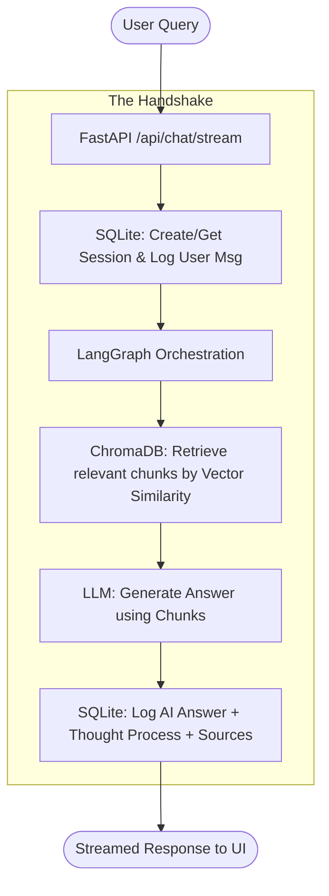

# Unified Database Orchestration Guide: The Pulse of RAG Chat IPR

This guide explains how the two primary databases in the **RAG Chat IPR** project—**ChromaDB** (Vector) and **SQLite** (Session/History)—function individually and together to create a seamless, intelligent user experience.

---

## 🏗️ The Dual-Database Architecture: "Meaning" vs. "Memory"

In a sophisticated RAG system, the agent needs two different kinds of data:
1.  **Meaning (External Knowledge)**: The facts extracted from your PDFs/DOCX files.
2.  **Memory (Contextual Conversation)**: What was said three turns ago, what the AI thought, and which specific files were mentioned.

To solve this, we use two specialized database engines:

| Feature | **ChromaDB** (Vector DB) | **SQLite** (Session/History) |
| :--- | :--- | :--- |
| **Primary Role** | External Knowledge Retrieval | Conversational Continuity & State |
| **Storage Engine** | Vector Similarity Search (HNSW) | Relational SQL (B-Trees) |
| **Data Format** | Embeddings (Vectors) + Text Chunks | JSON Objects + Structured Rows |
| **Physical Location**| `chroma_db/` (Folder) | `rag_chat_sessions.db` (File) |

---

## 🔄 The Data Lifecycle & Interplay

The magic happens in how these two databases "shake hands" during a single user query.

### 1. The Ingestion Hand-off (Creation)
When a file is uploaded to `upload_docs/`:
- **ChromaDB**'s territory: The file is sliced into chunks and embedded. These "meanings" are stored in the vector collection.
- **SQLite**'s territory: Not involved in individual chunk indexing, but it *is* implicitly ready to receive messages referencing these newly created filenames.

### 2. The Query Synchrony (Retrieval & Response)
When you ask: *"What does the Technical Report say about API safety?"*:

---

## 🛠️ Step-by-Step Breakdown: From Basics to Advanced

### How the Connection Works (The Code Level)
The "glue" between these databases is the **`session_id`** and the **`filename`**.

1.  **The API Layer (`routes.py`)**: When a request hits `/api/chat/stream`, it first talks to **SQLite** (via `history.py`) to ensure the session exists and to log the raw question.
2.  **The Retrieval Layer (`retriever.py`)**: Inside the LangGraph workflow, the agent queries **ChromaDB**. It asks for chunks where "Meaning ≈ Question".
3.  **The Finalization Layer (`history.py`)**: Once the AI generates the answer, the backend collects three things:
    -   The **Answer Text**.
    -   The **Thoughts** (internal steps).
    -   The **Sources** (filenames and content from ChromaDB).
    
    All three are bundled into a JSON-serialized format and committed to **SQLite**. This "Snapshot" ensures that when you return to the chat tomorrow, the AI "remembers" not just its answer, but exactly which PDF it was looking at when it gave that answer.

---

## ⚡ Unified Maintenance: `embedding_debug.py`

This script is the master utility for vector database health.
- **`rebuild`**: Performs a **Hard Reset** on ChromaDB by clearing the collection and re-indexing all documents.
- **`reindex`**: Allows for surgical updates to specific files while keeping the rest of the database intact.
- **`.env` Synergy**: It strictly follows the configuration in your `.env`, ensuring that both databases (Meaning and Memory) remain synced to the same AI logic.
- **Persistence**: While the Knowledge Base (ChromaDB) can be reset, your **Session DB** (`rag_chat_sessions.db`) is preserved, ensuring your conversation history remains available even after a KB rebuild.

---

## 🛡️ Privacy & Professional Standards

Both databases are **excluded by default** in `.gitignore`. 
- **ChromaDB** stores potentially sensitive document meanings.
- **SQLite** stores your private conversations.

By keeping them local and separated, your project achieves **High Speed** (ChromaDB retrieval is millisecond-fast) and **High Reliability** (SQLite provides ACID-compliant history persistence).

---

