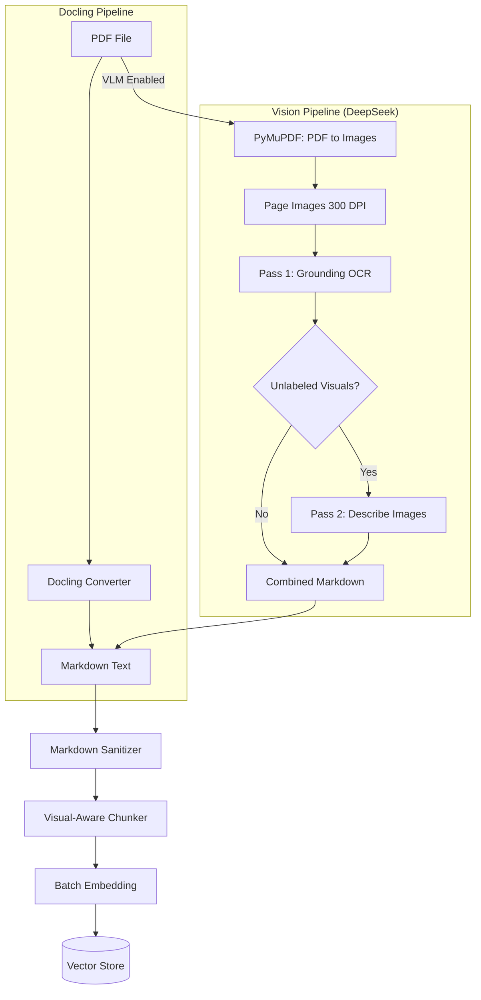

# 🔬 Vision-Language OCR Implementation Plan (DeepSeek VL)

## Executive Summary
This document outlines the integration of **DeepSeek OCR** (Vision-Language Model) into the RAG Chat IPR ingestion pipeline. The goal is to achieve high-fidelity text extraction from scanned PDFs and complex documents where traditional parsers fail.

---

## 0. Model Configuration (.env)

> [!IMPORTANT]
> **Inference Engine**: Ollama (local deployment)
> **Model**: `deepseek-ocr:3b` (run `ollama pull deepseek-ocr:3b`)
> **Requires**: Ollama v0.13.0+

### Environment Variables
```env
# VLM OCR Model Configuration
RAG_VLM_HOST="http://localhost:11434"
RAG_VLM_MODEL="deepseek-ocr:3b"

# Prompt Strategy
RAG_VLM_PROMPT="auto"
```

### Prompt Strategy Options
| Option | Behavior | Use Case |
| :--- | :--- | :--- |
| `auto` | Two-pass: grounding + describe unlabeled | Default, best accuracy |
| `grounding` | Single-pass document-to-markdown | Fast, well-labeled docs |
| `describe` | Single-pass detailed image description | Image-heavy docs |
| `parse_figure` | Single-pass figure/chart parsing | Chart-heavy docs |

---

## 1. Architecture Overview



---

## 2. Two-Pass Extraction (Auto Mode)

### Pass 1: Document Structure
- Prompt: `<|grounding|>Convert the document to markdown.`
- Extracts: Text, tables, headers, figure captions

### Pass 2: Visual Enrichment (Conditional)
- Triggered when:
  - Page has < 50 characters of text
  - Image placeholders detected (`[Figure ]`, `<image>`)
  - Low text density (< 30%)
- Prompt: `Describe this image in detail.`
- Output: `> [Visual Description]\n> Detailed description...`

---

## 3. Visual Element Detection

### Detected Patterns
| Type | Pattern | Example |
| :--- | :--- | :--- |
| `diagram` | `Figure X:`, `Fig. X:` | `Fig. 3 - Network Topology` |
| `table` | Markdown tables or `Table X:` | `Table 2: Port Mappings` |
| `chart` | `Diagram X:`, `Chart X:` | `Chart 1: Revenue Growth` |
| `image` | DeepSeek `> [Image: ...]` | `> [Image: Server rack photo]` |

### Visual-Aware Chunking
Tables and figures are **protected from fragmentation** during chunking. The chunker detects visual block boundaries and keeps them intact.

---

## 4. Enhanced Metadata Schema

```python
{
    # Existing Fields
    "filename": "Security_Policy.pdf",
    "source": "C:/Users/.../Security_Policy.pdf",
    "chunk_index": 42,
    "section_path": "Setup > Firewall > Port Rules",
    "header_level": 3,
    "is_fragment": False,
    
    # Visual Element Fields
    "has_visual": True,
    "visual_type": "diagram",      # "diagram", "table", "chart", "image"
    "visual_title": "Fig. 3 - Network Topology",
    "visual_count": 1
}
```

---

## 5. Platinum Envelope (Retriever Output)

When visual metadata is present, the retriever includes it:
```markdown
--- DOCUMENT SEGMENT ---
Source: Security_Policy.pdf
Section: Setup > Firewall > Port Rules
Visual: [DIAGRAM] Fig. 3 - Network Topology
Content: The following diagram shows the network architecture...
```

---

## 6. Dependencies

```bash
uv add pymupdf
```

---

## 7. Latency Analysis

| Phase | When | Latency | Frequency |
| :--- | :--- | :--- | :--- |
| Pass 1 (Grounding) | Ingestion | 5-15s/page | Once per doc |
| Pass 2 (Describe) | Ingestion | 3-10s/page | ~10-20% of pages |
| Sanitization | Ingestion | <100ms | Once per doc |
| Chunking | Ingestion | <200ms | Once per doc |

> [!NOTE]
> **Query time is unaffected.** All vision processing happens during ingestion.

---

*Last Updated: January 2026 • RAG Chat IPR v1.7*
