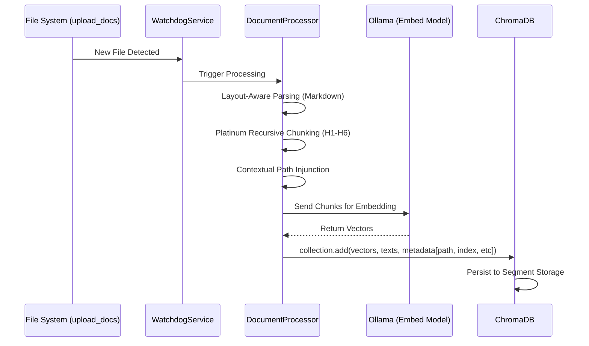

# Vector Database Encyclopedia: The Core of Neural Retrieval (ChromaDB)

This encyclopedia provides an exhaustive, A-Z technical deep-dive into the **Vector Database (ChromaDB)** powering the **RAG Chat IPR**. From mathematical underpinnings to real-world command-line management, this guide covers it all.

---

## 🧬 1. The Basics: What is a Vector Database?

In traditional databases (like Excel or SQL), you find data by matching words exactly. In a **Vector Database**, we find data by matching **concepts**.

1.  **Embeddings**: We convert text (like "The safe loading capacity is 5 tons") into a list of numbers (a "Vector").
2.  **Multidimensional Space**: These numbers represent a point in a massive 768 or 4096-dimensional space (depending on your model).
3.  **Similarity**: Two sentences with similar meanings (e.g., "Apple is a fruit" and "Banana is a healthy snack") will be physically close to each other in this space.

---

## 📂 2. Storage & Location

- **Location**: `chroma_db/` (Project Root).
-   **Engine**: Persistence is handled by **ChromaDB's PersistentClient**.
-   **Collection**: `rag_documents`.
-   **Data Types**:
    -   **`sqlite3.db`**: Stores metadata and the mapping between IDs.
    -   **Parquet/HNSW files**: Store the actual binary vector weights for ultra-fast retrieval.

---

## 🏗️ 3. The Ingestion Pipeline (Step-by-Step)

When a PDF/DOCX is added to `upload_docs/`, the following occurs:



### 3.1 Platinum Metadata Schema
For every chunk, we store a rich metadata envelope:
- `section_path`: Full recursive breadcrumb (e.g., `Setup > Security`).
- `chunk_index`: Sequence position for neighbor retrieval.
- `header_level`: Depth (1-6).
- `is_fragment`: Continuity bridge flag.

---

## 🔍 4. Retrieval Mechanics: How Data is Found

When you ask a question, the system doesn't "search" text; it performs a **Cosine Similarity Search**.

1.  **Query Embedding**: Your question is turned into a vector using the same model as the documents.
2.  **Top-K Retrieval**: ChromaDB looks for the `n` closest vectors in the collection.
3.  **Distance Scaling**: In `store.py`, we use `hnsw:space: "cosine"`. 
    -   `0.0` distance = Perfect match.
    -   `1.0` distance = Completely unrelated.

---

## 🛠️ 5. Related Files & Services

The Vector DB is a high-traffic "hub" in the project:

| File | Role | Connection Type |
| :--- | :--- | :--- |
| **`backend/rag/store.py`** | The Interface | The primary Python wrapper. Includes `.delete_file()` and `.clear_all()`. |
| **`backend/ingestion/processor.py`**| The Provider | Injects new data. Includes Extension Whitelisting and Error Handling. |
| **`backend/graph/nodes/retriever.py`**| The Consumer | Queries ChromaDB to find context for the LLM. |
| **`embedding_debug.py`** | The Technician | Unified tool for rebuilding, re-indexing, and probing. |

---

## ⌨️ 6. Common Commands & Maintenance

### How to Manage the Database
The `embedding_debug.py` script is your primary maintenance interface:

```bash
# 1. See all indexed files and metrics
uv run python embedding_debug.py list

# 2. Test raw retrieval scores for a specific query
uv run python embedding_debug.py probe "Your query here"

# 3. Wipe and perform a from-scratch rebuild
uv run python embedding_debug.py rebuild

# 4. Refresh a specific file from scratch
uv run python embedding_debug.py reindex "@MyDocument.pdf"
```

---

## 🚀 7. Advanced: Hierarchical & Targeted RAG

Your implementation of ChromaDB isn't standard; it supports **Semantic @Mentions**.

- **Global Mode**: Queries the entire database.
- **Targeted Mode**: If you mention `@Report.pdf`, the system adds a metadata filter `{"filename": "Report.pdf"}` to the ChromaDB query. This forces the database to ignore everything except that specific file, ensuring **100% precision**.

---


