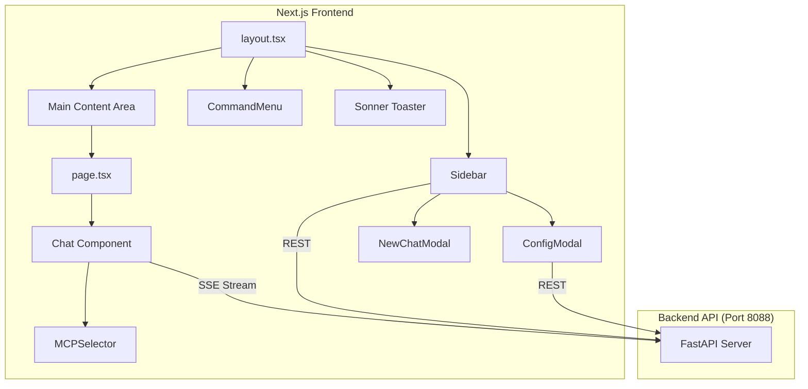
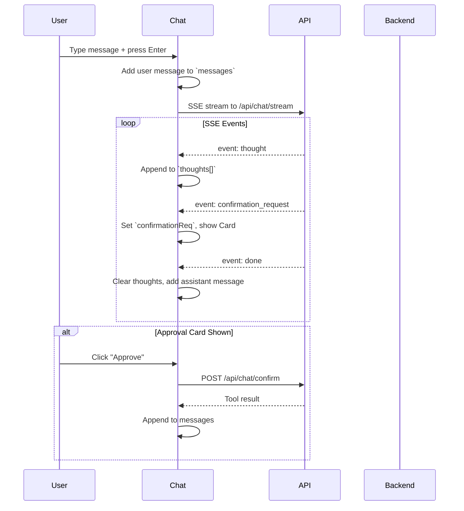

# Deep Dive: DevOps Agent Web UI

This document provides an exhaustive, developer-oriented deep dive into every component, hook, and design decision in the DevOps Agent Next.js frontend.

---

## Table of Contents

1. [Architecture Overview](#1-architecture-overview)
2. [App Router Structure](#2-app-router-structure)
3. [Component Deep Dives](#3-component-deep-dives)
   - [Chat.tsx](#31-chattsx)
   - [ConfigModal.tsx](#32-configmodaltsx)
   - [Sidebar.tsx](#33-sidebartsx)
   - [CommandMenu.tsx](#34-commandmenutsx)
   - [MCPSelector.tsx](#35-mcpselectortsx)
   - [NewChatModal.tsx](#36-newchatmodaltsx)
4. [API Client Layer](#4-api-client-layer)
5. [Styling System](#5-styling-system)
6. [State Management](#6-state-management)
7. [SSE Streaming Protocol](#7-sse-streaming-protocol)
8. [Human-in-the-Loop Safety](#8-human-in-the-loop-safety)

---

## 1. Architecture Overview



### Key Design Decisions

| Decision | Rationale |
|----------|-----------|
| **Next.js App Router** | Server components for metadata, client components for interactivity |
| **CSS Modules** | Component-scoped styles prevent leakage, no Tailwind overhead |
| **No Redux/Zustand** | Component-local state + URL params sufficient for this scale |
| **SSE over WebSockets** | Simpler backend, unidirectional streaming is sufficient |
| **Dynamic API Base** | Auto-detects hostname for LAN/remote deployments |

---

## 2. App Router Structure

### `layout.tsx`
Root layout that wraps all pages.

```tsx
// Key elements:
<body>
    <Sidebar />              // Left panel (always visible)
    <main>
        <div className="aurora-bg" />  // Animated background
        {children}           // Page content
    </main>
    <CommandMenu />          // Cmd+K palette (floating)
    <Toaster />              // Toast notifications (bottom-right)
</body>
```

**Fonts:**
- Sans: Helvetica Neue (system)
- Mono: JetBrains Mono (Google Fonts, for code blocks)

### `page.tsx`
Entry point for `/` route.

```tsx
export default function Home() {
    return (
        <Suspense fallback={<Loading />}>
            <ChatWrapper />
        </Suspense>
    );
}

function ChatWrapper() {
    const searchParams = useSearchParams();
    const sessionId = searchParams.get("session"); // URL-based session
    return <Chat sessionId={sessionId} />;
}
```

**Session Routing:** Sessions are identified via `?session=<uuid>` URL parameter, enabling:
- Browser back/forward navigation
- Shareable session URLs
- Bookmarkable sessions

### `globals.css`
Design token system with CSS variables.

```css
:root {
    /* Colors */
    --bg-app: #18181b;        /* Zinc-900 */
    --bg-card: #27272a;       /* Card surfaces */
    --accent-primary: #6366f1; /* Indigo-500 */
    
    /* Status */
    --status-success: #10b981;
    --status-error: #ef4444;
    
    /* Fonts */
    --font-sans: 'Helvetica Neue', sans-serif;
    --font-mono: 'JetBrains Mono', monospace;
}
```

**Utility Classes:**
- `.glass` - Glassmorphism effect
- `.animate-fade-in` - Entry animation
- `.aurora-bg` - Rotating gradient background

---

## 3. Component Deep Dives

### 3.1 `Chat.tsx`

The core chat interface. **~520 lines, most complex component.**

#### State Variables

| State | Type | Purpose |
|-------|------|---------|
| `messages` | `ChatMessage[]` | Rendered message list |
| `input` | `string` | Current input field value |
| `isLoading` | `boolean` | Show loading indicator during stream |
| `sessionId` | `string \| undefined` | Current session (from URL) |
| `thoughts` | `ThoughtItem[]` | Real-time streaming thoughts |
| `mode` | `string` | Selected MCP routing mode |
| `confirmationReq` | `object \| null` | Pending approval card data |
| `isConfirming` | `boolean` | Lock UI during confirmation |

#### Message Flow



#### SSE Event Handlers

```tsx
eventSource.addEventListener("thought", (event) => {
    const data = JSON.parse(event.data);
    setThoughts(prev => [...prev, data]);
});

eventSource.addEventListener("confirmation_request", (event) => {
    const data = JSON.parse(event.data);
    setConfirmationReq(data);  // Triggers Approval Card render
});

eventSource.addEventListener("done", (event) => {
    const data = JSON.parse(event.data);
    setMessages(prev => [...prev, {
        role: "assistant",
        content: data.output,
        thoughts: thoughts  // Attach accumulated thoughts
    }]);
    setThoughts([]);
    setIsLoading(false);
});
```

#### Approval Card UI

```tsx
{confirmationReq && (
    <div className="approval-card">
        <h4>⚠️ Action Requires Approval</h4>
        <p><strong>Reason:</strong> {confirmationReq.risk?.reason}</p>
        
        {confirmationReq.risk?.impact_analysis?.map((item, i) => (
            <li key={i}>{item}</li>
        ))}
        
        <code>{confirmationReq.tool}</code>
        <pre>{JSON.stringify(confirmationReq.arguments, null, 2)}</pre>
        
        <button onClick={() => setConfirmationReq(null)}>Deny</button>
        <button onClick={handleConfirm}>Approve & Execute</button>
    </div>
)}
```

---

### 3.2 `ConfigModal.tsx`

Agent configuration wizard with 3 sections. **~450 lines.**

#### Sections

| Section | Icon | Purpose |
|---------|------|---------|
| Smart Agent | 🧠 | Primary reasoning model (e.g., qwen2.5:72b) |
| Fast Agent | ⚡ | Quick response model (e.g., llama3.2) |
| Embedding Model | 🔍 | RAG/semantic search model (e.g., nomic-embed-text) |

#### State Variables

| State | Type | Purpose |
|-------|------|---------|
| `configMode` | `"default" \| "custom"` | Toggle between preset and custom config |
| `smartHost/Model` | `string` | Smart agent configuration |
| `fastHost/Model` | `string` | Fast agent configuration |
| `embeddingHost/Model` | `string` | Embedding model configuration |
| `smartModels[]` | `string[]` | Available models on smart host |
| `presets[]` | `Preset[]` | Saved configurations (localStorage) |
| `saveStatus` | enum | UI state machine for save button |

#### Save Flow State Machine

```
idle → validating → applying → success
         ↓              ↓
       error ←←←←←←←←←←←←
```

```tsx
const [saveStatus, setSaveStatus] = useState<
    "idle" | "validating" | "applying" | "success" | "error"
>("idle");

// Save button renders different states:
{saveStatus === "validating" && <RefreshCw className="animate-spin" />}
{saveStatus === "applying" && "Applying..."}
{saveStatus === "success" && <CheckCircle />}
```

#### Preset Management

Presets are stored in `localStorage` under key `agent_config_presets`.

```tsx
interface Preset {
    name: string;
    smartHost: string;
    smartModel: string;
    fastHost: string;
    fastModel: string;
    // Note: Embedding not yet in presets
}
```

---

### 3.3 `Sidebar.tsx`

Session list and system status. **~210 lines.**

#### Features

1. **Session List:** Clickable links to `/?session=<id>`
2. **New Chat Button:** Opens `NewChatModal`
3. **Live Status Display:**
   - Fast Agent: status dot + model name
   - Smart Agent: status dot + model name
   - MCP Servers: 3 status tags (Docker, K8s L, K8s R)
4. **Start Servers Button:** Selective startup of MCP servers

#### Status Polling

```tsx
useEffect(() => {
    checkStatus();
    const interval = setInterval(checkStatus, 10000);  // Every 10s
    return () => clearInterval(interval);
}, []);
```

#### MCP Server Selection

```tsx
const [selectedServers, setSelectedServers] = useState<Set<string>>(
    new Set(["docker", "k8s_local", "k8s_remote"])
);

// Toggle selection for servers not yet running
function toggleServerSelection(server: string) {
    const newSet = new Set(selectedServers);
    if (newSet.has(server)) newSet.delete(server);
    else newSet.add(server);
    setSelectedServers(newSet);
}
```

---

### 3.4 `CommandMenu.tsx`

Global command palette using `cmdk` library. **~60 lines.**

#### Keyboard Shortcut

```tsx
useEffect(() => {
    const down = (e: KeyboardEvent) => {
        if (e.key === "k" && (e.metaKey || e.ctrlKey)) {
            e.preventDefault();
            setOpen(prev => !prev);
        }
    };
    document.addEventListener("keydown", down);
    return () => document.removeEventListener("keydown", down);
}, []);
```

#### Available Commands

| Command | Action |
|---------|--------|
| New Chat | Navigate to `/` |
| Open Settings | Dispatch `window.dispatchEvent(new Event("open-settings"))` |
| Home | Navigate to `/` |

---

### 3.5 `MCPSelector.tsx`

Dropdown for routing mode selection. **~65 lines.**

#### Options

| ID | Label | Color | Purpose |
|----|-------|-------|---------|
| `auto` | Auto (Smart) | Blue | Let agent decide routing |
| `chat` | Chat Only | Green | No tool execution |
| `docker` | Docker Only | Cyan | Force Docker tools |
| `k8s_local` | Local K8s | Violet | Force local K8s |
| `k8s_remote` | Remote K8s | Amber | Force remote K8s |

---

### 3.6 `NewChatModal.tsx`

Simple modal for creating new sessions. **~60 lines.**

#### Default Title

```tsx
useEffect(() => {
    if (isOpen) {
        const date = new Date();
        setTitle(`Session - ${date.toLocaleTimeString([], {
            hour: '2-digit',
            minute: '2-digit'
        })}`);
    }
}, [isOpen]);
```

#### Keyboard Handling

- `Enter` → Create session
- `Escape` → Close modal

---

## 4. API Client Layer

### `lib/api.ts`

Centralized API client with auto-detecting base URL.

```tsx
const getBase = () => {
    if (typeof window !== 'undefined') {
        return `http://${window.location.hostname}:8088/api`;
    }
    return "http://localhost:8088/api";
};
```

#### Functions

| Function | Endpoint | Purpose |
|----------|----------|---------|
| `getSessions()` | GET `/sessions` | List all sessions |
| `createSession(title)` | POST `/sessions` | Create new session |
| `getSessionHistory(id)` | GET `/sessions/:id` | Get messages for session |
| `deleteSession(id)` | DELETE `/sessions/:id` | Delete session |
| `getConfig()` | GET `/config` | Get current agent config |
| `updateConfig(data)` | POST `/config` | Update agent config |
| `getSystemStatus()` | GET `/status` | Check LLM/MCP health |
| `scanModels(host)` | POST `/models/scan` | List models on a host |
| `confirmAction(tool, args, session_id)` | POST `/chat/confirm` | Approve destructive action |

---

## 5. Styling System

### CSS Modules

Each component has a co-located `.module.css` file:

```
components/
├── Chat.tsx
├── Chat.module.css
├── ConfigModal.tsx
├── ConfigModal.module.css
...
```

### Common Patterns

```css
/* Glass effect */
.card {
    background: rgba(24, 24, 27, 0.7);
    backdrop-filter: blur(12px);
    border: 1px solid rgba(255, 255, 255, 0.08);
}

/* Status dots */
.dotGreen { color: var(--status-success); }
.dotRed { color: var(--status-error); }

/* Buttons */
.primaryBtn {
    background: var(--accent-primary);
    transition: background 0.2s;
}
.primaryBtn:hover {
    background: var(--accent-hover);
}
```

---

## 6. State Management

### Strategy: Component-Local + URL

- **No global state library** (Redux, Zustand, Jotai)
- **Session ID via URL:** `?session=<uuid>` enables sharing/bookmarking
- **Event Bus pattern:** Cross-component communication via `window.dispatchEvent`

```tsx
// Sidebar listens:
window.addEventListener("open-settings", handleOpenSettings);

// CommandMenu dispatches:
window.dispatchEvent(new Event("open-settings"));
```

---

## 7. SSE Streaming Protocol

The backend streams events via **Server-Sent Events** to `/api/chat/stream`.

### Event Types

| Event | Payload | Purpose |
|-------|---------|---------|
| `thought` | `{type, content}` | Real-time reasoning step |
| `tool_call` | `{name, arguments}` | Tool being executed |
| `tool_result` | `{name, result}` | Tool execution result |
| `confirmation_request` | `{tool, arguments, risk}` | Approval card trigger |
| `done` | `{output}` | Final response |
| `error` | `{message}` | Error occurred |

### Connection Flow

```tsx
const eventSource = new EventSource(
    `${API_BASE}/chat/stream?session_id=${sessionId}&query=${encodeURIComponent(input)}`
);

eventSource.onerror = () => {
    eventSource.close();
    setIsLoading(false);
};
```

---

## 8. Human-in-the-Loop Safety

### Approval Card Flow

1. Backend detects dangerous tool (e.g., `docker_stop_container`)
2. Backend emits `confirmation_request` SSE event
3. Frontend shows Approval Card with:
   - **Reason:** Why this action is dangerous
   - **Impact Analysis:** List of potential consequences
   - **Tool Call:** Name + arguments
4. User clicks **Deny** → Card dismissed, no action
5. User clicks **Approve** → `confirmAction()` API call → Tool executed

### Risk Assessment Fields

```typescript
interface ConfirmationRequest {
    tool: string;
    arguments: Record<string, any>;
    risk?: {
        is_dangerous: boolean;
        risk_level: "LOW" | "MEDIUM" | "HIGH";
        reason: string;
        impact_analysis: string[];
    };
}
```

---

## Appendix: File Size Summary

| File | Lines | Purpose |
|------|-------|---------|
| Chat.tsx | ~520 | Main chat interface |
| ConfigModal.tsx | ~450 | Configuration wizard |
| Sidebar.tsx | ~210 | Session list + status |
| api.ts | ~160 | API client |
| globals.css | ~130 | Design tokens |
| CommandMenu.tsx | ~60 | Cmd+K palette |
| MCPSelector.tsx | ~65 | Mode selector |
| NewChatModal.tsx | ~60 | New session modal |
| layout.tsx | ~45 | Root layout |
| page.tsx | ~25 | Entry page |
