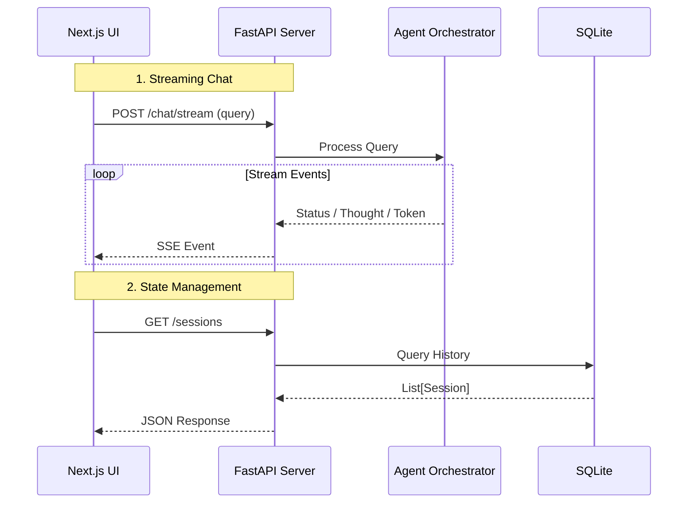

# Backend API Documentation

> **Base URL:** `http://localhost:8088/api`  
> **Protocol:** REST + Server-Sent Events (SSE)

This document details the API provided by `devops_agent/api_server.py`. The Next.js frontend (`ui/`) uses this API for all operations, including chat, session management, and configuration.

---

## 🏗️ Architecture

The backend follows a **Backend-for-Frontend (BFF)** pattern. It wraps the complex Agent logic, MCP servers, and LLM clients into a unified HTTP interface.



---

## 📡 Endpoints

### 1. Chat & Streaming

#### `POST /chat/stream`
The primary endpoint for interacting with the agent.

**Request Body:**
```json
{
  "query": "Restart the nginx pod",
  "session_id": "uuid-string",
  "mode": "auto",       // Options: "auto", "chat", "docker", "k8s_local", "k8s_remote"
  "model_override": "qwen2.5:72b" // Optional
}
```

**Response:** `text/event-stream` (Server-Sent Events)

**Events Types:**

| Event | Data Format | Description |
|-------|-------------|-------------|
| `status` | `string` | High-level status update (e.g., "Thinking...", "Connecting...") |
| `thought` | `string` | Internal chain-of-thought log (e.g., "Vector search found 3 relevant tools") |
| `token` | `{ "token": "Hello" }` | Real-time text generation chunk |
| `tool_calls` | `[{ "name": "...", "arguments": {...} }]` | Emitted when the agent decides to run tools |
| `confirmation_request` | `{ "tool": "...", "risk_level": "HIGH" }` | **Action Required:** UI must prompt user to approve/deny |
| `error` | `string` | Stream failed (e.g., LLM overloaded) |
| `done` | `[DONE]` | Stream completed successfully |

**Frontend Implementation Example:**
```typescript
const eventSource = new EventSource("/api/chat/stream", requestOptions);

eventSource.addEventListener("token", (e) => {
  const payload = JSON.parse(e.data);
  appendMessage(payload.token);
});

eventSource.addEventListener("confirmation_request", (e) => {
  const req = JSON.parse(e.data);
  showApprovalCard(req);
});
```

---

### 2. Session Management

#### `GET /sessions`
List all conversation sessions.

**Response:**
```json
[
  {
    "id": "550e8400-e29b-41d4-a716-446655440000",
    "title": "Debugging Nginx",
    "last_activity": "2024-12-23T10:00:00Z",
    "message_count": 12
  }
]
```

#### `GET /sessions/{id}`
Get full chat history for a session.

**Response:**
```json
{
  "id": "...",
  "messages": [
    {
      "role": "user",
      "content": "List pods",
      "timestamp": "..."
    },
    {
      "role": "assistant",
      "content": "Here are the pods...",
      "thoughts": [
        { "type": "thought", "content": "Checking k8s context..." }
      ]
    }
  ]
}
```

#### `POST /sessions`
Create a new empty session.
```json
{ "title": "New Chat" }
```

#### `DELETE /sessions/{id}`
Delete a session and its history.

---

### 3. Configuration & System Status

#### `GET /status`
Real-time health check of the entire system.

**Response:**
```json
{
  "agents": {
    "smart": { "active": true, "model": "qwen2.5:72b", "host": "http://10.20..." },
    "fast": { "active": true, "model": "llama3.2", "host": "localhost" }
  },
  "mcp": {
    "docker": true,
    "k8s_local": true,
    "k8s_remote": false // Server process died or not started
  }
}
```

#### `POST /mcp/start`
Launch background MCP server processes.

**Request:**
```json
{ "servers": ["docker", "k8s_remote"] }
```

#### `POST /config`
Hot-reload configuration without restarting.

**Request:**
```json
{
  "smart_model": "llama3-70b",
  "embedding_host": "http://new-host:11434"
}
```

#### `GET /pulse/status`
Real-time connectivity and health status for all MCP providers.

#### `GET /pulse/index`
The global resource map (Discovery Engine) showing pod/deployment locations.

---

### 4. Human-in-the-Loop Hooks

#### `POST /chat/confirm`
Approve a suspended destructive action (received via `confirmation_request` event).

**Request:**
```json
{
  "tool": "docker_rm_container",
  "arguments": { "container_id": "abc12345" },
  "session_id": "..."
}
```

**Response:**
```json
{
  "output": "Container abc12345 removed",
  "result": { "success": true }
}
```

---

## 🧩 Type Definitions (TypeScript)

Use these interfaces in the frontend code:

```typescript
interface ChatRequest {
  query: string;
  sessionId?: string;
  mode?: "auto" | "chat" | "docker" | "k8s_local" | "k8s_remote";
}

interface ConfirmationRequest {
  tool: string;
  arguments: Record<string, any>;
  risk_level: "LOW" | "MEDIUM" | "HIGH";
  reason: string;
}

interface SessionSummary {
  id: string;
  title: string;
  last_activity: string;
  message_count: number;
}
```
